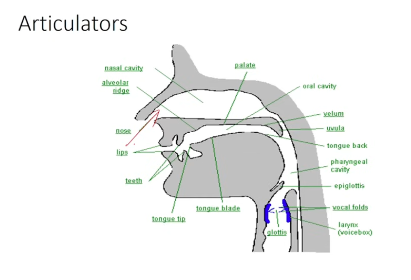
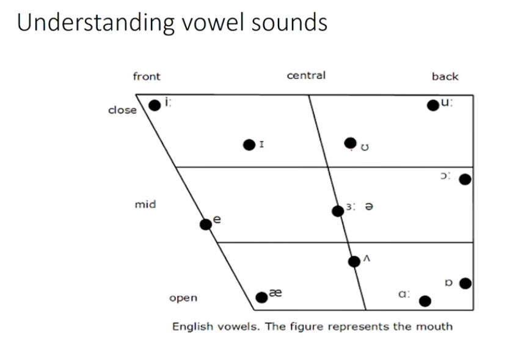

# ENGLISH I

**IIT Madras | Week 1 | Handwritten notebook guide**

Learning language, understanding sounds, and finding patterns.

## Before you begin

This notebook covers **Lectures 02-07**, the six lectures supplied in your original file. Lecture 01 is not present in that file. The explanations below combine repeated spoken passages, retain the lecture topics, slide information, examples, and exercises, and turn them into notes you can copy by hand. The original transcript and all 31 slide images remain available in the source file.

**How to write this in your notebook**

1. Begin each lecture on a fresh page. Write its number, title, and date at the top.
2. Leave a small left margin for keywords and a blank line between ideas.
3. Use one colour for headings and another for explanations. Underline important terms.
4. Copy definitions into small boxes. Draw tables with a ruler; avoid decorating every line.
5. Write examples immediately below the rule they explain.
6. Finish each lecture with its revision box and practice tasks. Leave space for your answers.

**Reading the notation**

| Mark | Meaning | Example |
| --- | --- | --- |
| `/ /` | Sounds, rather than ordinary spelling | *cat* = /kæt/ |
| `[ ]` | A more detailed description of pronunciation | [pʰ] = aspirated p |
| `ː` | A long vowel in the course notation | /iː/ in *seat* |
| `ˈ` | The following syllable has primary stress | /ˈdædi/ = *daddy* |
| C / V | Consonant sound / vowel sound | *cat* = CVC |
| + / - | A feature is present / absent | +voice / -voice |

**Important:** A letter, a letter name, and a speech sound are different things. In IPA, /j/ means the **y sound in yes**; /dʒ/ means the **j sound in jam**. A diphthong such as /aɪ/ counts as **one vowel unit**, although its quality changes as you say it.

The course uses the traditional **44-sound teaching model**: 20 vowels and 24 consonants. Its vowel examples mostly follow a traditional British, non-rhotic pronunciation, in which *r* is not normally pronounced after a vowel unless another vowel follows. Accent differences are identified where they matter.

**Clarification boxes** distinguish a transcript error or a simplified lecture claim from the pronunciation guidance to practise. They are included so that you can preserve the course point without memorising an inaccurate rule.

**Contents**

| Part | What you will learn |
| --- | --- |
| Lecture 02 | Acquisition, learning, patterns, and daily practice |
| Lecture 03 | Writing symbols, letter names, and the 44 sounds |
| Lecture 04 | Speech production and places of articulation |
| Lecture 05 | Vowel positions, aspiration, voicing, and accent |
| Lecture 06 | Diphthongs, semi-vowels, and connected speech |
| Lecture 07 | Word patterns and consonant clusters |
| Revision and practice | Definitions, recall questions, and exercise records |
| Source reference | Corrections, checking resources, and all original slides |

## Lecture 02 | Learning language

**Focus:** Acquisition, patterns, and an effective strategy for English mastery.

### 1. Why study how language works?

Language is a sophisticated product of the human mind. Despite its complexity, it has patterns and structure. Understanding these patterns helps us learn English and recognise structure in other kinds of data.

This basic English course forms part of IIT Madras's programme in data science and computer programming. It develops **listening, speaking, reading, and writing**. Most learners already know some English; the aim is to improve that knowledge and use it confidently.

> **Core idea:** Pay attention to patterns, understand them, apply them, and observe their effect on your own language.

### 2. Acquisition and learning

| Acquisition | Learning |
| --- | --- |
| Language develops largely automatically through exposure. | A learner makes deliberate efforts to improve. |
| The process is mainly subconscious. | Conscious attention works alongside subconscious processing. |
| Children are the lecture's main example. | Older learners are the lecture's main example. |
| Patterns are discovered without formal explanation. | Patterns can be noticed, discussed, and consciously applied. |

Children generally progress from **single words to two-word combinations, short phrases, and sentences**. The lecture explains this through an innate human capacity for language.

The slide names two concepts from an innateness-based theory of language:

- **LAD - Language Acquisition Device:** a proposed inborn capacity for acquiring language.
- **UG - Universal Grammar:** proposed underlying principles shared by human languages.

**Clarification:** LAD and UG belong to a theoretical account of acquisition; they are not literal organs. The unclear transcript word “aptism” appears in this discussion of innate capacity and is not a term to memorise.

### 3. Early and later language development

| Stage used in the lecture | Description |
| --- | --- |
| Before about 10 years | Acquisition is described as automatic and relatively effortless. |
| Between about 10 and 15 years | A transition period; language learning still occurs. |
| After about 15 years | Learning generally involves conscious effort and directed motivation. |

The lecturer also uses **before and after 12 years** as an alternative illustration. He explicitly says the exact numbers are not the main point. They are teaching boundaries for comparing early acquisition and later learning.

**Clarification:** Do not treat these ages as fixed biological deadlines. Adults can learn languages, and different abilities can develop differently with age. Research on grammar learning does not establish that a person's vocal tract becomes permanently unable to learn new sounds at 12 or 15. [Age and learning research](https://news.mit.edu/2018/cognitive-scientists-define-critical-period-learning-language-0501).

### 4. Input, processing, and output

Copy this flow into three boxes:

**Immediate environment -> Human mind -> Spoken language**

| Stage | What happens |
| --- | --- |
| Input | A child hears language from the surrounding society. The input is limited, variable, and not always designed as a lesson. |
| Processing | The mind finds patterns and computes relationships in the input. The lecture diagram labels this stage LAD/UG. |
| Output | The child produces meaningful, grammatical language, including combinations not directly memorised from the input. |

The slide describes input as **fuzzy and limited**, and output as **grammatical and infinite**. Here, *infinite* points to open-ended productive capacity, especially the ability to form new expressions; it does not mean that someone has counted an infinite vocabulary.

### 5. How older learners can use this process

Older learners already have at least one language. They also have interests, goals, and the ability to examine structure consciously.

Follow this sequence:

1. **Observe** a pattern in what you hear or read.
2. **Understand** what the pattern does.
3. **Apply** it in your own language use.
4. **Allow repeated exposure and subconscious processing** to reinforce it.
5. **Observe your output** and notice whether your speaking or writing improves.

The lecturer emphasises meaningful observation and use rather than memorising everything mechanically. A specific motivation helps sustain the effort. Think about an earlier attempt to learn a language and identify the goal that motivated you.

### 6. Your first language and your English accent

Early language experience establishes familiar sound habits. These habits can influence the pronunciation of a later language.

The lecture describes this as “conditioning of the vocal tract.” Its practical message is to notice differences between languages and practise selected sounds consciously.

> **Remember:** You can communicate impressively while sounding like yourself. You do not have to copy an American, British, or Australian identity.

**Clarification:** Established pronunciation habits can be strong, but they are not proof that an adult's speech organs are physically locked. Improvement remains possible with listening, feedback, and practice.

### 7. A daily learning routine

| Skill | Recommended practice | What to notice |
| --- | --- | --- |
| Listening | At least **30 minutes every day** | The speaker's sounds, word combinations, pronunciation, and way of speaking |
| Reading | At least **30 minutes every day** | Useful vocabulary, sentence patterns, and clear expression |
| Speaking | Keep using English regularly | Whether what you hear and read appears in your speech |
| Writing | Practise it as a separate skill | How ideas are organised and expressed in written language |

For listening, news bulletins are suggested, but other English audio or video also works. Listening must be **attentive**, not merely playing material in the background.

For reading, combine a regular newspaper with material you enjoy: stories, novels, science, fiction, politics, or other books. The lecturer recommends newspapers for their often simple, active, affirmative sentences; this is a reading suggestion, not a claim that every newspaper sentence has that form.

Listening supports speaking. Reading and listening provide material that can influence speech through repeated exposure. Continue speaking as these processes develop.

Writing needs specific practice: many people speak a language without being able to write it. The course will address writing separately.

### Revision box

**Acquisition = largely automatic development through exposure.**

**Learning = deliberate effort, attention, and practice.**

**Observe -> Understand -> Apply -> Reinforce -> Review your output.**

**Daily foundation: 30 minutes listening + 30 minutes reading.**

### Practice tasks

- Write your main reason for improving English.
- Identify one pattern you heard and one pattern you read today.
- Reflect on how your first language influences your English pronunciation.
- Begin the daily listening and reading record in the practice section.

## Lecture 03 | Sounds and writing symbols

**Focus:** Separate the way English is written from the way it is spoken.

### 1. Two systems

| Writing system | Sound system |
| --- | --- |
| Uses letters and spelling conventions. | Uses the sounds we produce and hear. |
| English has **26 letters**. | The course teaches **44 sounds**. |
| A letter can represent different sounds. | A sound can be represented by different letters or combinations. |
| Learning to write requires specific effort. | Early spoken language develops largely through exposure. |

This lecture is not an introduction to the alphabet for beginners. It asks you to examine familiar letters in a new way.

### 2. Uppercase and lowercase letters

**Uppercase:** A B C D E F G H I J K L M N O P Q R S T U V W X Y Z

**Lowercase:** a b c d e f g h i j k l m n o p q r s t u v w x y z

Both sets represent the same 26 letters. Capitals occur at the beginning of sentences, in proper names, and in many abbreviations. They are not required at the beginning of every word in a sentence.

**Reflection question from the lecture:** Why do we have two sets? Could a writing system work with only one? The lecture invites you to think about this; it does not provide a historical answer.

### 3. What “A for apple” actually teaches

Children may first learn letters through musical rhymes, then through example words:

| Letter | Example word | Letter | Example word |
| --- | --- | --- | --- |
| A | apple | F | fan |
| B | ball | G | girl |
| C | cat | H | house |
| D | dog | I | ink |
| E | elephant | J-Z | Complete these yourself. |

“A for apple” means **apple begins with the written letter A**. It does not mean that *apple* begins with the spoken letter name /eɪ/.

Compare:

- Letter **A** is named /eɪ/; *apple* begins with /æ/.
- Letter **C** is named /siː/; *cat* begins with /k/.
- Letter **E** is named /iː/; *elephant* begins with /e/.
- Letter **F** is named /ef/; *fan* begins with /f/.
- Letter names such as B /biː/, D /diː/, G /dʒiː/, H /eɪtʃ/, and I /aɪ/ are also different from the initial sounds in *ball, dog, girl, house,* and *ink*.

**Worked example:** *cat* = /k/ + /æ/ + /t/ = **three sounds**, even though its first letter is C.

The lecture is not ridiculing alphabet rhymes. It shows that they mainly teach **writing symbols**, not a consistent sound-to-letter relationship.

### 4. Letter names also contain sounds

The name of a letter can itself contain a sequence of sounds. For example, **B** /biː/ contains /b/ and /iː/; **C** /siː/ contains /s/ and /iː/. **W**, “double-u,” has a name that is a whole spoken sequence.

The table below supplies the letter-name reference discussed in the transcript. The transcript mentions such a chart, but a separate image of it was not supplied.

| Letter pair | Name in sounds | Letter pair | Name in sounds |
| --- | --- | --- | --- |
| A a | /eɪ/ | N n | /en/ |
| B b | /biː/ | O o | /əʊ/ |
| C c | /siː/ | P p | /piː/ |
| D d | /diː/ | Q q | /kjuː/ |
| E e | /iː/ | R r | /ɑː/ |
| F f | /ef/ | S s | /es/ |
| G g | /dʒiː/ | T t | /tiː/ |
| H h | /eɪtʃ/ | U u | /juː/ |
| I i | /aɪ/ | V v | /viː/ |
| J j | /dʒeɪ/ | W w | /ˈdʌbəl juː/ |
| K k | /keɪ/ | X x | /eks/ |
| L l | /el/ | Y y | /waɪ/ |
| M m | /em/ | Z z | British /zed/; American /ziː/ |

**Accent note:** O is commonly /oʊ/ in American English, and R includes /r/ in rhotic accents. The unclear transcript contrast for Z is **zed versus zee**.

### 5. Five vowel letters do not mean five vowel sounds

**Vowel letters:** A, E, I, O, U.

**Vowel sounds in the course model:** 20.

The letters are writing symbols that often represent vowel sounds. The actual vowel inventory is much larger than five. All speech sounds are grouped broadly into **vowels and consonants**.

### 6. All 20 vowel sounds

The table retains the first vowel chart and the additional examples in the later 44-sound chart. Pay attention to the **target vowel**, not every sound in the word.

| Sound | Main slide example | Additional lecture/chart examples |
| --- | --- | --- |
| /ɪ/ | pit | sit |
| /e/ | pet | pep, men |
| /æ/ | pat | cat |
| /ɒ/ | pot | not |
| /ʌ/ | but | butt |
| /ʊ/ | book | book |
| /ə/ | mother | first vowel in America |
| /iː/ | bean | read, meaning the present-tense verb |
| /ɜː/ | burn | word |
| /ɑː/ | barn | part |
| /ɔː/ | born | sort |
| /uː/ | boon | too; the lecture also mentions boom |
| /aɪ/ | bite | my |
| /eɪ/ | bait | day |
| /ɔɪ/ | boy | boy |
| /əʊ/ | toe | go |
| /aʊ/ | house | how |
| /ʊə/ | poor | tour |
| /ɪə/ | ear | here |
| /eə/ | air | wear |

**Read carefully:** In *mother*, the chart targets the **second**, unstressed vowel /ə/; its first vowel is /ʌ/. *Read* in the past tense is /red/, so the chart's /iː/ example uses the present-tense reading /riːd/.

**Clarification:** The 20-vowel inventory is a traditional teaching model, not a count valid for every accent. For example, many speakers use /ɔː/ in *poor* rather than /ʊə/. Use one pronunciation model consistently when doing an exercise.

### 7. All 24 consonant sounds

Each row includes examples from the supplied consonant charts and the later complete sound chart. The target is usually the first sound; exceptions are stated.

| Sound | First chart | Second chart | Later complete chart |
| --- | --- | --- | --- |
| /p/ | pit; transcript also says pet | pin | pig |
| /b/ | bit | bad | bed |
| /t/ | tab | tin | time |
| /d/ | dab | dog | do |
| /k/ | cab | kind | kilo |
| /g/ | gab | gun | go |
| /f/ | fan | five | five |
| /v/ | van | van | very |
| /s/ | sad | say | six |
| /z/ | zoo | zoo | zoo |
| /m/ | man | man | milk |
| /n/ | not | nose | no |
| /h/ | hot | half | hello |
| /l/ | lad | leg | live |
| /r/ | red | run | read |
| /w/ | wed | work | window |
| /θ/ | thought | thin | think |
| /ð/ | then | that | the |
| /ʃ/ | shy | ship | short |
| /ʒ/ | treasure: middle sound | measure: middle sound | casual: middle sound |
| /tʃ/ | chime | church | church |
| /dʒ/ | jam | jam; transcript says gent | judge |
| /j/ | yum | yes | yes |
| /ŋ/ | sing: final sound | thing: final sound | sing: final sound |

The transcript contains slips such as “20 consonants” and “24 vowels.” The intended course totals are **24 consonants and 20 vowels**.

### 8. A finite sound set, many possible expressions

**20 vowels + 24 consonants = 44 sounds.**

A small inventory supports a very large, productive vocabulary and countless expressions through combinations. The lecturer uses *infinite* to emphasise this open-ended productivity; the total vocabulary is not a fixed, universally agreed number.

### 9. How attention improves learning

**Pay attention -> Let patterns become familiar -> Observe your own output.**

Notice where spelling and pronunciation differ. Compare English sounds with your first language. Sound awareness can strengthen pronunciation, reading, writing, and confidence. You need not analyse every word consciously whenever you speak; the aim is to develop familiarity.

### Revision box

**26 letters are writing symbols; 44 sounds are the course's speech inventory.**

**Letter name ≠ the sound represented in every word.**

**A, E, I, O, U are five vowel letters, not the entire vowel inventory.**

### Practice tasks

1. Complete example words for letters J-Z.
2. Read all 20 vowel examples several times, listening to the target sound.
3. Find **five words for each vowel sound: 20 × 5 = 100 words**.
4. Find **five words for each consonant sound: 24 × 5 = 120 words**.
5. Begin with one example per sound if five feels too much. Complete the sets gradually; they need not be done in one day.
6. Occasionally identify the consonants and vowels in words you read or speak.

## Lecture 04 | Speech sounds in English

**Focus:** How the vocal tract produces vowels and consonants.

### 1. Why learn the mechanics of speech?

Understanding how sounds are produced helps you compare English with your other languages. Specific practice is more useful than repeating unfamiliar sounds without understanding them.

Greater control over pronunciation can improve confidence, clarity, effectiveness, and communication. Attentive practice also contributes to the subconscious learning process discussed in Lecture 02.

### 2. Airflow and the vocal tract

For the English sounds studied here, speech uses air **flowing out of the lungs**. This is called **egressive pulmonic airflow**.

**Lungs -> Trachea -> Larynx/vocal folds -> Throat -> Mouth or nose.**

The outgoing air is modified in the vocal tract to make different sounds. The lecture contrasts this with inhaling; the ordinary English sounds here are made on exhalation.

### 3. Main parts to label in a diagram

| Part | Meaning or role |
| --- | --- |
| Lips and teeth | Help shape or obstruct airflow. |
| Alveolar ridge | Ridge immediately behind the upper front teeth. |
| Hard palate | Firm part of the roof of the mouth. |
| Velum / soft palate | Back part of the mouth's roof; helps control access to the nasal passage. |
| Uvula | Small hanging structure at the rear edge of the soft palate. |
| Tongue tip, blade, and back | Move into different positions to produce sounds. |
| Oral cavity | Mouth passage. |
| Nasal cavity | Nose passage. |
| Pharyngeal cavity | Throat passage behind the mouth. |
| Epiglottis | Structure shown near the entrance to the larynx in the slide. |
| Larynx | Voice box containing the vocal folds. |
| Vocal folds / vocal cords | Can vibrate to produce voicing. |
| Glottis | Space between the vocal folds. |

**Diagram to study or copy:**

This is a side-section diagram. Label the parts first, then trace the outward airflow. The tongue is a major movable articulator; the lips and soft palate can also move.

### 4. Vowels and consonants

| Vowels | Consonants |
| --- | --- |
| Produced without a major narrowing or closure in the mouth. | Produced with a closure, narrowing, or other articulatory configuration. |
| Air passes relatively freely; tongue and lip positions shape the vowel. | The place and type of obstruction help identify the sound. |
| Usually form the centre of a syllable. | Usually occur around that centre. |
| Can be sustained while breath lasts. | Stops such as /p t k/ cannot themselves be sustained. |

The lecturer calls vowels more fundamental because of their central role in word and syllable formation. “Free flow” is a useful contrast; vowel production still involves shaping the vocal tract.

**Try:** Hold a vowel such as /ɑː/. Then try to hold /k/. If you say “kaaaa,” you are extending the vowel after /k/, not holding the stop itself.

**Clarification:** Some consonants, including /s/, /f/, and /m/, can also be sustained. The lecture's demonstration applies most directly to **stop consonants**, not all consonants. See [consonant classification](https://www.cambridge.org/features/IPAchart/).

### 5. Short and long vowel contrasts

| Course grouping | Short example(s) | Long example(s) |
| --- | --- | --- |
| “a / aa” | up, cup: /ʌ/ | father: /ɑː/ |
| “i / ii” | in, ink, sink, drink: /ɪ/ | clean, seat, beat, feet: /iː/ |
| “u / uu” | book, cook, look: /ʊ/ | zoo, boot, room: /uː/ in the course model |

**Minimal-pair example:** *sit* /sɪt/ and *seat* /siːt/ differ in their vowel and therefore in meaning.

**Clarification:** In English, these contrasts often involve vowel **quality as well as duration**. /ʌ/ and /ɑː/ are not simply the same sound at different lengths. The original slide also puts *sound* and *round* under “aa”; they actually contain the diphthong **/aʊ/**. Retain them as diphthong examples, not /ɑː/ examples. Pronunciation of *room* can vary.

The lecture uses these six sounds as introductory examples, not as the whole English vowel inventory. It encourages you to look for comparable sounds and contrasts in your own language.

### 6. Place of articulation

**Place of articulation = where the tongue, lips, or other articulators shape or obstruct the airflow.**

| Place | How it is formed | Introductory example |
| --- | --- | --- |
| Velar | Back of the tongue contacts the soft palate. | k |
| Palatal | Front/body of the tongue approaches the hard palate. | The comparative chart's c/ch series |
| Retroflex | Tongue tip curls back toward the area behind the alveolar ridge. | The comparative chart's T/D series |
| Dental | Tongue contacts or approaches the teeth. | The comparative chart's t/d series |
| Bilabial | Both lips participate. | p, b, m |

**Clarification:** *Retroflex* and *alveolar* are distinct articulations. Not every sound made near the alveolar ridge involves tongue curling. The comparative chart's labels are broad teaching descriptions, not a complete IPA analysis of every language.

### 7. The 25-sound comparative chart

This chart is used to compare sounds familiar from several Indian languages. It is **not the inventory of 24 English consonants**.

| Place | -asp, -voice | +asp, -voice | -asp, +voice | +asp, +voice | Nasal |
| --- | --- | --- | --- | --- | --- |
| Velar | k | kh | g | gh | ng |
| Palatal | c | ch | j | jh | ny |
| Retroflex | T | Th | D | Dh | N |
| Dental | t | th | d | dh | n |
| Labial | p | ph | b | bh | m |

**Count:** 5 places × 4 oral sounds = **20 oral sounds**; plus **5 nasal sounds** = **25**.

The chart retains the slide's simple notation. Here **h indicates the aspiration-related series**, not necessarily a separate /h/ sound. **T, D, N** indicate retroflex sounds; **ng** represents /ŋ/, and **ny** represents a palatal nasal. **th** in this chart is not the English sound /θ/ in *thin*.

The columns are explained in Lecture 05. For now, concentrate on the rows: the places of articulation.

### 8. Oral and nasal sounds

| Oral sounds | Nasal consonants |
| --- | --- |
| The velum is raised, closing the route to the nose. | The velum is lowered, opening the route to the nose. |
| Air exits through the mouth. | An oral closure directs air through the nose. |
| /p/ is a bilabial oral stop. | /m/ is a bilabial nasal. |
| /t/ is an alveolar oral stop in the reference English model. | /n/ is an alveolar nasal in that model. |

**Clarification:** The transcript gives the nasal-opening function to the uvula. The main articulator controlling it is the **velum / soft palate**. For /m n ŋ/, the mouth is blocked at the relevant place while air exits through the nose; “air always comes through both mouth and nose” is not the correct account of these nasal stops. See [speech articulators](https://openlibrary-repo.ecampusontario.ca/jspui/bitstream/123456789/497/6/Essentials-of-Linguistics-1539375829.html).

### 9. Places of articulation for English consonants

| Place | Sounds in the course inventory |
| --- | --- |
| Bilabial | /p b m/ |
| Labiodental: lower lip and upper teeth | /f v/ |
| Dental: tongue and teeth | /θ ð/ |
| Alveolar | /t d n s z l/; /r/ is often grouped here in introductory charts |
| Post-alveolar | /ʃ ʒ tʃ dʒ/ |
| Palatal | /j/ |
| Velar | /k g ŋ/ |
| Glottal | /h/ |
| Labial-velar: lips plus tongue-back gesture | /w/ |

**Reference-chart note:** The supplied English articulation chart also shows a **glottal stop [ʔ]** and a **tap/flap [ɾ]**. These can occur as pronunciation variants; they are not two extra phonemes to add to the course's 24. The chart does not display every member of that 24-sound inventory, so use the complete sound table in Lecture 03 as your checklist. The exact articulation of /r/ varies by accent.

### Revision box

**English speech here uses outgoing air from the lungs.**

**Vowels: relatively open airflow. Consonants: a distinctive articulatory configuration.**

**Place tells us WHERE; the next lecture explains more about HOW.**

**Raised velum -> oral airflow. Lowered velum -> nasal route available.**

### Practice tasks

1. Spend about **30 minutes** exploring where the sounds are made.
2. Say each sound and identify the tongue/lip movement. There is nothing embarrassing about practising slowly.
3. Compare p with m, and t with n. Notice oral versus nasal airflow.
4. Find more examples of the short/long contrasts in the vowel table.
5. Check which of these places and sounds occur in your first language.

## Lecture 05 | Articulation of vowels and consonants

**Focus:** Describe a sound precisely and identify the English sounds that need your attention.

### 1. Describing vowels

Vowels are shaped mainly by the position of the tongue and the lips, with no major oral closure.

The lecture's vowel diagram uses two directions:

- **Horizontal position:** front, central, or back of the mouth.
- **Vertical position:** close/high, mid, or open/low tongue position.

“Close” refers to a raised tongue; “open” refers to a lower tongue. It does not mean that a close vowel completely closes off the air.

| Area in the diagram | Examples in the course model |
| --- | --- |
| Front | /iː ɪ e æ/ |
| Central | /ɜː ə ʌ/ |
| Back | /uː ʊ ɔː ɒ ɑː/ |
| Near the close/high end | /iː uː/; /ɪ ʊ/ are slightly lower |
| Around the middle | /e ə ɜː ɔː/ at different mid heights |
| Toward the open/low end | /æ ʌ ɑː ɒ/ at different low heights |

**Diagram to study or copy:**

Read the diagram as an approximate map of vowel positions, not a literal picture of the tongue. Front/back and high/low positions vary somewhat across accents. Lip rounding is another useful descriptive feature, although the lecture's main emphasis is on tongue position.

Review the **20-vowel table in Lecture 03** and the **three short/long groupings in Lecture 04**. Phonetic symbols are useful reference aids; the lecturer's priority is recognising the sound in a spoken word.

### 2. Place alone does not identify a consonant

In the comparative chart, k, kh, g, and gh are all velar, yet they differ. To distinguish them, the lecture introduces two features:

**Aspiration = an extra burst of breath after release.**

**Voicing = vibration of the vocal folds during the relevant part of a sound.**

Place answers **where** a sound is made. Manner answers **how the airflow is shaped**. Voicing and aspiration add further details about its production.

### 3. Aspiration: the palm test

Hold your palm a short distance in front of your mouth. Compare the chart's **k and kh**, or **p and ph**. In the aspirated member, you should feel a stronger breath release.

| Feature | Meaning |
| --- | --- |
| -aspiration | No strong aspiration in the chart's comparison. |
| +aspiration | A noticeable additional breath release. |

The test helps you notice a difference without laboratory equipment. Repeat gently and listen as well as feeling the airflow.

### 4. Voicing: the vibration test

Lightly touch the front of your throat while comparing voiced and voiceless sounds. The lecture uses **k and g**; a sustained **/s/ versus /z/** comparison can make the vibration easier to notice.

| Feature | Meaning | Example |
| --- | --- | --- |
| -voice | No vocal-fold vibration for the target consonant. | /k p t s f/ |
| +voice | Vocal-fold vibration accompanies the consonant. | /g b d z v/ |

If the difference is not immediately obvious in the hand test, understand the distinction and continue listening. You do not need to force your voice to prove it.

### 5. Four combinations in the comparative chart

| Aspiration | Voicing | Velar series | Bilabial series |
| --- | --- | --- | --- |
| - | - | k | p |
| + | - | kh | ph |
| - | + | g | b |
| + | + | gh | bh |

The same four-column pattern applies to the other oral rows of the 25-sound chart in Lecture 04. The fifth column gives the nasal at each place.

**Example description:** In that chart, **p = bilabial, oral, unaspirated, voiceless stop**. Adding place to the two features gives a more specific identity.

**Clarification:** The traditional “voiced aspirated” series in several Indian languages is often analysed in terms of **breathy voice**. The slide's +asp/+voice notation is a comparative teaching simplification.

**English aspiration note:** English /p t k/ can be aspirated, especially at the beginning of a stressed syllable, and are usually unaspirated after /s/, as in *spin, stop,* and *school*. They remain the same phonemes rather than becoming a second set to add to the 24. See [aspirated stops in English](https://openlibrary-repo.ecampusontario.ca/jspui/bitstream/123456789/497/6/Essentials-of-Linguistics-1539375829.html).

### 6. Manners of articulation: a compact guide

The supplied English chart labels the rows stop, nasal, flap, fricative, approximant, and lateral approximant. Add affricates to complete the familiar English inventory.

| Manner | What the airflow does | English examples |
| --- | --- | --- |
| Stop / plosive | A closure stops the oral air, followed by release. | /p b t d k g/ |
| Nasal | Oral closure with air exiting through the nose. | /m n ŋ/ |
| Fricative | Air passes through a narrow gap, creating friction. | /f v θ ð s z ʃ ʒ h/ |
| Affricate | A stop releases into friction as one consonant unit. | /tʃ dʒ/ |
| Approximant | Articulators approach without strong friction. | /r j w/ |
| Lateral approximant | Air passes around the sides of the tongue. | /l/ |
| Tap / flap | A very brief contact of the tongue. | [ɾ], a variant shown in the slide chart |

### 7. English t/d and retroflex T/D

In the reference English articulation model, **/t d/** are **alveolar stops**: the tongue tip or blade contacts the alveolar ridge without the backward curling used for retroflex stops.

In the comparative chart, **T/D** represent **retroflex** sounds, with the tongue tip curled back. Many learners transfer familiar first-language pronunciations into English.

The lecture mentions:

- **Dravidian languages:** Tamil, Telugu, Malayalam, and Kannada.
- **Indo-Aryan languages:** Hindi, Punjabi, Bhojpuri, Magahi, Odia, Bengali, and others.

It describes retroflex sounds as especially prominent in Dravidian languages, while also present in many Indo-Aryan languages. The inventories differ from language to language; do not assume every language has exactly the same retroflex set.

**Clarification:** “English has no retroflex sounds” is too broad across all varieties. The useful course comparison is between **retroflex stops in the learner's language and alveolar /t d/ in the reference model**. English /r/ can also have a retroflex articulation in some accents.

**Practice:** Say /t d/ with a gentle alveolar contact. Compare this with the retroflex equivalents you know. Use the articulation appropriate to the language and pronunciation model you are practising.

### 8. English f/v and a bilabial aspirated p

| Sound | Place and production | Lecture examples |
| --- | --- | --- |
| English /f/ | Voiceless labiodental fricative: upper teeth approach lower lip. | father, French, fat, friend |
| English /v/ | Voiced labiodental fricative. | van, very |
| Comparative-chart ph | Aspirated bilabial stop: both lips close and release. | The lecture's Hindi examples, transcribed as pal and pool |

The point is **/f/ is not simply an aspirated /p/**. The transcript does not give clear native-script spellings for the Hindi examples, so use them only to remember the articulation comparison.

The availability of /f/ and /v/ varies among languages and speakers. Identify the actual contrast you need rather than assuming that everyone with the same first language has the same difficulty.

### 9. Indian English and confidence

**Indian English** names a variety of English, just as **British English, American English, Australian English**, and varieties of English spoken in Africa name varieties associated with their speakers and regions.

The term is not inherently offensive. First-language sound habits help explain features of a learner's English. The lecturer calls this the “Indianness” of the variety.

The aim is to understand your pronunciation, improve intelligibility, and practise selected unfamiliar sounds with confidence. You can retain your identity while gaining greater control over pronunciation.

### 10. Choose a small, useful practice set

1. Review all **24 consonants and 20 vowels**.
2. Identify sounds shared with your first language.
3. Identify sounds that differ in place, manner, voicing, aspiration, or vowel quality.
4. Focus practice on that smaller set of differences.
5. Keep questions about unclear sounds for the instructor.

### Revision box

**Vowels: tongue height + front/back position; also consider the lips.**

**Consonants: place + manner + voicing; aspiration may also matter.**

**English /t d/: alveolar in the reference model. English /f v/: labiodental.**

### Practice tasks

- Compare k/kh/g/gh using the two feature tests.
- Write the place and features of each oral row in the 25-sound chart.
- Practise alveolar /t d/ and labiodental /f v/ in words.
- List the English sounds common to your first language and those needing special practice.
- Note questions raised by your practice and bring them to the instructor.

## Lecture 06 | Diphthongs and semi-vowels

**Focus:** Understand vowel glides, non-syllabic consonants, and smooth connected speech.

### 1. The sound inventory, classified further

**44 sounds = 20 vowels + 24 consonants.**

**20 vowels = 12 monophthongs + 8 diphthongs** in the traditional course model.

The **12 monophthongs** comprise **7 short vowels** /ɪ e æ ɒ ʌ ʊ ə/ and **5 long vowels** /iː ɜː ɑː ɔː uː/ in the course notation.

Within the consonants, **/w/ and /j/** are the two sounds specifically treated as semi-vowels. /r/ is discussed alongside them in the transcript, but it is normally classed as an approximant/liquid rather than one of these two semi-vowels.

### 2. Monophthong and diphthong

| Monophthong | Diphthong |
| --- | --- |
| Has one relatively steady vowel quality. | Has a glide from one vowel quality toward another. |
| The tongue position is comparatively stable. | The articulatory position changes during the vowel. |
| Example: /iː/ in bean. | Example: /aɪ/ in buy. |

**Diphthong = a single vowel unit with a changing quality within one syllable.**

The movement is called a **glide**. The two IPA characters show its start and end, not two separate syllables. In the course's falling-diphthong model, the first part is generally stronger and longer than the second; the whole is grouped with long vowels for introductory practice.

### 3. The eight diphthongs

| Sound | Glide | Main lecture examples |
| --- | --- | --- |
| /eɪ/ | e toward ɪ | take |
| /aɪ/ | a toward ɪ | buy; transcript also says by |
| /ɔɪ/ | ɔ toward ɪ | boy |
| /ɪə/ | ɪ toward ə | fear |
| /eə/ | e toward ə | care |
| /əʊ/ | ə toward ʊ | go |
| /ʊə/ | ʊ toward ə | poor |
| /aʊ/ | a toward ʊ | cow |

In American English, the *go* vowel is commonly written /oʊ/. Centre-ending diphthongs such as /ɪə eə ʊə/ are especially tied to the traditional British model; other accents can realise these words differently.

### 4. Worked sound counts

| Word | Course-model transcription | Sound units | Pattern |
| --- | --- | --- | --- |
| take | /teɪk/ | /t/ + /eɪ/ + /k/ = 3 | CVC |
| buy / by | /baɪ/ | /b/ + /aɪ/ = 2 | CV |
| boy | /bɔɪ/ | /b/ + /ɔɪ/ = 2 | CV |
| fear | /fɪə/ | /f/ + /ɪə/ = 2 | CV |
| care | /keə/ | /k/ + /eə/ = 2 | CV |
| go | /gəʊ/ | /g/ + /əʊ/ = 2 | CV |
| poor | /pʊə/ | /p/ + /ʊə/ = 2 | CV |
| cow | /kaʊ/ | /k/ + /aʊ/ = 2 | CV |

**Clarification:** In rhotic accents, *fear, care,* and *poor* include an /r/ sound, so their sound counts differ. Also, an aspirated pronunciation of the /t/ in *take*, [tʰ], still counts as one consonant.

### 5. All examples from the diphthong slide

| Diphthong | Example set |
| --- | --- |
| /eɪ/ | take, aim, prey, break, late |
| /aɪ/ | high, ice, fly, type, right |
| /ɔɪ/ | boy, oil, alloy, voice, toy |
| /əʊ/ | slow, owe, go, float, lone; **bowl** belongs here too |
| /aʊ/ | owl, cow, brow, allow; **bow** when it means bend the body |
| /ɪə/ | peers, ear, clear, fear, real |
| /ʊə/ in the traditional model | jury, cure, poor |
| /eə/ | pair, air, care, bear, their |

**Slide clarifications:**

- The slide places **bowl** under /aʊ/, but standard *bowl* has /əʊ/ in British English or /oʊ/ in American English. *Bow* meaning bend the body is a suitable /aʊ/ example. [Bowl pronunciation](https://dictionary.cambridge.org/pronunciation/english/bowl).
- The /ʊə/ column has one blank entry. It is a prompt to find another example, not a missing printed word.
- The slide also lists **fuel** there. It is often /ˈfjuːəl/, a sequence including /uː/ and /ə/, rather than a simple /ʊə/ diphthong example. [Fuel pronunciation](https://www.collinsdictionary.com/us/dictionary/english-pronunciations/fuel).
- **Jury** has a traditional British /ʊə/ pronunciation; other accents differ. [Jury pronunciation](https://dictionary.cambridge.org/pronunciation/english/jury).
- **Real**, *cure*, and the centre-ending examples vary by accent and may be pronounced with a different vowel or syllable structure. Check audio rather than relying on spelling.
- The transcript says *pierce* and *jewelry* while the slide shows **peers** and **jury**. Keep *peers/jury* as the intended slide examples; *pierce* can illustrate /ɪə/ in the traditional model, while *jewelry* is not a dependable /ʊə/ example.

### 6. What is a syllable?

**Syllable = a unit of spoken word structure, usually built around a vowel.**

A word with one syllable is **monosyllabic**. Other words contain two or more syllables. Syllables help connect the study of individual sounds with the study of whole words.

Vowels are usually **syllabic**: they can form a syllable's centre or nucleus.

**Clarification:** The lecture says every syllable must contain a vowel. That is a useful introductory model, but English also has **syllabic consonants**, as in the final /l/ of some pronunciations of *funnel* [fʌnl̩]. The important contrast here is that **/w/ and /j/ are non-syllabic**. See [syllabic consonants](https://openlibrary-repo.ecampusontario.ca/jspui/bitstream/123456789/497/6/Essentials-of-Linguistics-1539375829.html).

### 7. Semi-vowels /w/ and /j/

**Semi-vowels = vowel-like, non-syllabic consonants.**

| Property | Explanation |
| --- | --- |
| Relatively open articulation | No complete oral closure or strong friction, giving a vowel-like quality. |
| Non-syllabic | They do not form the syllable nucleus in the ordinary English model. |
| Consonant behaviour | They occupy consonant positions and accompany vowels. |
| IPA notation | /w/ as in well; /j/ as in yes. |

They are called semi-vowels because their articulation resembles vowels while their role is consonantal. They are not “half of a consonant,” and their presence alone does not supply the normal syllabic vowel.

### 8. Examples: sounds do not require the matching letter

| /w/ examples | What to notice |
| --- | --- |
| well, world | /w/ at the beginning, written w. |
| twin, sweet | /w/ inside an initial consonant sequence. |
| suite | /swiːt/; the slide's example is **suite**, not sweet. Both illustrate /w/. |
| acquire | /əˈkwaɪə/ in the reference model; /w/ is present without a written w. |
| question | /ˈkwestʃən/; the initial sound sequence includes /kw/. |

| /j/ examples | What to notice |
| --- | --- |
| yesterday | Initial /j/ is written y. |
| beauty | /ˈbjuːti/; /j/ occurs without written y. |
| steward | /ˈstjuːəd/ in a traditional British model; some accents omit /j/. |
| few | /fjuː/; /j/ occurs without written y. |

**Clarification:** The slide and transcript also list **intrusion** under /j/. Its usual pronunciation is /ɪnˈtruːʒən/, with **/ʒ/** and no /j/. It is retained here as an example to correct, not as a semi-vowel example. [Intrusion pronunciation](https://dictionary.cambridge.org/us/dictionary/english/intrusion).

### 9. Final letters w/y do not necessarily mean final semi-vowels

In the course's phoneme analysis, /w/ and /j/ do not occur as ordinary word-final consonants. A final written w or y is not evidence of a final semi-vowel.

| Word | Final sound in the reference model |
| --- | --- |
| window | /əʊ/, a diphthong |
| cow | /aʊ/, a diphthong |
| happy | /i/, a vowel |
| Monday | /eɪ/ in a full pronunciation, or /i/ in another common pronunciation |

The glide within a final diphthong is analysed as part of the vowel here, not as a separate final /w/ or /j/ consonant.

### 10. Semi-vowels in connected speech

When one word ends in a vowel and the next begins in a vowel, speech can move smoothly between them with a **/w/-like or /j/-like linking glide**.

| Lecture phrase | Boundary to listen to | Typical glide |
| --- | --- | --- |
| Go away. | go + away | go-(w)-away |
| I am late. | I + am | I-(j)-am |
| Say it. | say + it | say-(j)-it |
| Buy it. | buy + it | buy-(j)-it |
| Put your shoe on. | shoe + on | shoe-(w)-on |
| Blue is my favorite color. | blue + is | blue-(w)-is |
| Three years. | three + years | /j/ is already the initial consonant of years |

**Clarifications:** The slide labels *blue is* with y; the usual glide after /uː/ is **/w/**. *Three years* is a vowel-to-consonant sequence, because *years* already starts with /j/; it is not evidence that a new /j/ was inserted between two vowel-initial/final words.

The distribution is patterned:

- **/w/-like transitions** are common after /uː/ or diphthongs ending toward /ʊ/, such as /əʊ/ and /aʊ/, before another vowel.
- **/j/-like transitions** are common after /iː/ or diphthongs ending toward /ɪ/, such as /eɪ/ and /aɪ/, before another vowel.

These glides can arise naturally in connected speech; their strength depends on the speaker and context. Do not force a strong extra consonant or insert a glide after every vowel. The British Council illustrates /w/ between *go* and *up* in its guide to [connected speech](https://www.teachingenglish.org.uk/professional-development/teachers/teaching-knowledge-database/c/connected-speech).

Recognising the transitions can improve both pronunciation and listening comprehension, especially when speech is fluent and word boundaries are less obvious.

### Revision box

**12 steady-quality vowels + 8 vowel glides = 20 vowels in the course model.**

**A diphthong counts as one vowel unit within a syllable.**

**/w j/ are vowel-like consonants, but non-syllabic.**

**Study sounds, not just final letters or spelling.**

### Practice tasks

1. Transcribe the eight main diphthong words and identify their vowel units.
2. Add more words for each diphthong; use dictionary audio if needed.
3. Compare monophthongs with diphthongs and notice whether the quality stays steady or glides.
4. Find /w/ and /j/ in words with and without written w/y.
5. Say the connected-speech phrases slowly, then fluently; listen for the transitions.
6. Collect more phrases where one word ends in a vowel and the next begins in a vowel.

## Lecture 07 | Consonant clusters in English words

**Focus:** Recognise sound sequences and the rules governing adjacent consonants.

### 1. Words contain sound patterns

Words are formed from consonant and vowel sound sequences. **C = consonant sound; V = vowel unit.** Count sounds, not letters.

The lecture presents vowels as fundamental to forming words. A word can contain a vowel without a consonant, as in *I* or *eye* /aɪ/.

**Clarification:** A vowel is the usual syllable centre; the lecture's universal “no word or syllable without a vowel” claim has exceptions involving syllabic consonants. Use the introductory C/V model for the exercises, while keeping the distinction from Lecture 06 in mind.

### 2. Simple sound patterns

| Pattern | Examples | How to count |
| --- | --- | --- |
| CVCV | papa, daddy, mommy | Four sound units; alternate C and V. |
| CVC | dad, mom | Consonant + vowel + consonant. |
| VC | am, is, it, in, on, at | Vowel + consonant. |
| CV | the, when /ðiː/; sea /siː/ | One consonant and one long vowel. |
| V | I; eye /aɪ/ | One diphthong vowel unit; no consonant. |

For example, *daddy* /ˈdædi/ has **/d/ + /æ/ + /d/ + /i/**. Its double written d does not add an extra consonant. *Mommy* is likewise CVCV; its first vowel varies by accent. The /æ/ in *daddy* is a monophthong, despite the unclear transcript calling it a diphthong.

The lecture also lists **or / are** under VC. They are VC in rhotic pronunciations with final /r/, but may be vowel-only in non-rhotic pronunciation. The pattern depends on what you actually say.

**Slide clarification:** One slide prints **CVV** for *the/sea* and another prints **CVCVCV** beside *papa/daddy/mommy*. In ordinary phonemic counting these are **CV** and **CVCV**, respectively. A long vowel is still one vowel unit, and a diphthong is not two separate V positions here.

### 3. What is a consonant cluster?

> **Definition:** A consonant cluster is a sequence of two or more consonant sounds with no intervening vowel sound.

| Word | Sound sequence | Pattern | Cluster |
| --- | --- | --- | --- |
| glass | /g l ɑː s/ in the British model | CCVC | /gl/ at the beginning |
| sink | /s ɪ ŋ k/ | CVCC | /ŋk/ at the end |

The two written s letters in *glass* represent one /s/. The n in *sink* represents **/ŋ/** before /k/, not the ordinary /n/ of *not*.

Say *glass* smoothly as /glɑːs/, without inserting a separate vowel between /g/ and /l/. An added vowel changes the sound sequence.

### 4. The lecture's “inbuilt a” explanation

The lecturer explains a cluster by starting with consonants spoken as **ka, ga, pa**, and so on. In that teaching pronunciation, a small vowel follows the consonant. Removing the vowel before another consonant helps demonstrate a cluster.

**Clarification:** A consonant does not inherently contain a vowel. The vowel is part of the way it has been named or practised. The precise cluster rule is simply **adjacent consonant sounds with no vowel between them**.

### 5. Clusters can occur in different positions

| Position | Example | Cluster |
| --- | --- | --- |
| Initial: beginning | glass, bliss, school | /gl/, /bl/, /sk/ |
| Medial: middle | cluster | /st/ |
| Final: end | sink, blast | /ŋk/, /st/ |
| More than one in a word | cluster, blast | Initial /kl/ or /bl/, plus /st/ |

Clusters occur in different positions, but **not in random order**. The sound combinations permitted in a language form part of its **phonotactics**.

**Important:** “Clusters occur anywhere” does not mean that every particular cluster is permitted at every position.

### 6. Consonant features used in the examples

| Sound | Place | Voicing | Main manner |
| --- | --- | --- | --- |
| /k/ | Velar | Voiceless | Stop |
| /g/ | Velar | Voiced | Stop |
| /p/ | Bilabial | Voiceless | Stop |
| /b/ | Bilabial | Voiced | Stop |
| /ŋ/ | Velar | Voiced | Nasal |
| /l/ | Alveolar | Usually voiced | Lateral approximant / liquid |

The comparative slide marks k/g and p/b as unaspirated in its feature comparison. Remember from Lecture 05 that English aspiration depends on the sound's context.

In /gl/, /g/ and /l/ have different articulations. In /ŋk/, the nasal and the stop are both velar. These examples show that **place, manner, and voicing are separate features**.

### 7. More examples from the lecture and slides

| Word | Cluster(s) | Note |
| --- | --- | --- |
| king | None in the usual /kɪŋ/ pronunciation | Written ng represents one /ŋ/, not /ŋg/. |
| class | /kl/ | Initial cluster. |
| great | /gr/ | Initial cluster. |
| glass | /gl/ | Initial cluster. |
| gloss | /gl/ | The transcript also uses this word; its vowel differs from glass, but the initial cluster is the same. |
| pink | /ŋk/ | Final cluster; initial /p/ is not in a cluster. |
| pure | /pj/ in /pjʊə/ | A cluster if your pronunciation includes /j/. |
| bliss | /bl/ | Initial cluster. |
| bless | /bl/ | Initial cluster. |
| school | /sk/ | Initial cluster. |
| scooter | /sk/ | Initial cluster. |
| blast | /bl/ and /st/ | Both initial and final clusters. |
| cluster | /kl/ and /st/ | Initial and medial clusters. |

**Clarification:** The transcript says *pure* has no cluster. In the reference pronunciation /pjʊə/, **/p j/** is a consonant cluster. The final e in its spelling does not supply a vowel sound.

### 8. The same-place claim: retain the point, correct the rule

The slides say that non-nasal consonants from the same place of articulation do not form clusters, giving **pb, bp, td** as disallowed examples. They then allow same-place combinations involving nasals, such as **mb, bm**, and **mm**.

**Clarification:** This is not a general English rule. For example, **/st/** is an allowed cluster of two alveolar consonants, as in *stop* and *blast*. Cluster permissions depend on the language, position, manner, and word structure, not only on whether the two consonants share a place.

The useful observation to retain is that **some consonant combinations are restricted while others are permitted**. A nasal-plus-stop cluster can share a place, as in **/mp/** in *lamp* or **/ŋk/** in *sink*. Do not equate two written consonants, such as mm, with two separate spoken consonants automatically. See [consonant clusters](https://iastate.pressbooks.pub/oralcommunication2e/chapter/consonant-clusters/).

### 9. Clusters of three consonants at the beginning

The final slide gives these six examples:

| Word | Initial cluster | Sound pattern |
| --- | --- | --- |
| spring | /spr/ | CCCVC: /s p r ɪ ŋ/ |
| stress | /str/ | CCCVC: /s t r e s/ |
| screw | /skr/ | CCCV: /s k r uː/ |
| splash | /spl/ | CCCVC: /s p l æ ʃ/ |
| string | /str/ | CCCVC: /s t r ɪ ŋ/ |
| scrub | /skr/ | CCCVC: /s k r ʌ b/ |

**Transcript clarification:** *Screw* is the intended slide example where the transcript says *cream*. *Cream* begins with only /kr/, a two-consonant cluster. The slide's CCCVV for *screw* counts a long vowel as two V positions; in the phonemic counting used here it is **CCCV**.

### 10. The recurring pattern

The lecture's example set gives:

**/s/ + /p, t, or k/ + /r or l/**

| Slot | Sound type | Examples |
| --- | --- | --- |
| First | Voiceless alveolar fricative | /s/ |
| Second | Voiceless stop | /p/: bilabial; /t/: alveolar; /k/: velar |
| Third in the lecture set | Liquid | /r/ or /l/ |

The transcript sometimes calls English /t/ dental; the reference English chart places it at the **alveolar ridge**.

Add the lecture's further examples: **screen, scroll, scrutiny, stress, scrap, strand, strict, strip, spring**. Their initial clusters fit the pattern demonstrated in the lecture.

**Clarification:** The lecture overstates this by saying the third consonant can only be /r/ or /l/. Common examples such as **square, squeeze, and squash** have **/skw/**; some British pronunciations also have /j/, as in **skew** /skjuː/. A fuller introductory template is:

**/s/ + voiceless stop /p t k/ + approximant /l r w j/**

Not every combination of those slots is allowed. The familiar pattern is highly restricted, and varieties or borrowed words can add complications. See [Iowa State University's cluster guide](https://iastate.pressbooks.pub/oralcommunication2e/chapter/consonant-clusters/).

### 11. Four-consonant clusters and productive combinations

In the usual English syllable model, initial clusters have a maximum of **three consonants**. The lecture therefore says there are no ordinary four-consonant clusters at the beginning of English words.

Clusters of **four at the end** can occur, often when an ending is added. Supplementary examples: **texts** /teksts/ has final /ksts/; **sixths** /sɪksθs/ has final /ksθs/.

The lecturer contrasts the large number of possible sound combinations with the more restricted set containing complex clusters. He invites you to extend the relatively short list of words beginning with three consonants. No numerical vocabulary count is supplied.

A finite sound inventory creates many words through combinations. Words commonly have four, five, six, seven, or more sounds; there is no single fixed number for all words, and different words have different numbers of syllables. Clusters are a natural part of this structure, though they are not required in every longer word.

### 12. Why clusters matter

Recognising clusters helps you:

- Distinguish simple alternating sound sequences from more complex sequences.
- Avoid adding unwanted vowels or dropping consonants in pronunciation.
- Understand word structure and build confidence in your analysis.
- Extend your vocabulary through careful attention to words and their sounds.
- See how a language follows patterns and rules, connecting the lecture to pattern-finding in data science.

### Revision box

**Cluster = two or more adjacent consonant sounds, with no vowel between them.**

**Count sounds, not letters. A diphthong or long vowel is one V unit.**

**Clusters can be initial, medial, or final, subject to restrictions.**

**Common three-consonant onset: /s/ + voiceless stop + approximant.**

### Practice tasks

1. Find **four words with VCVC** and **four with CV**. These retain the slide's word-pattern exercise while correcting its CVV notation. As a starting example, *edit* /ˈedɪt/ is VCVC, and *sea* /siː/ is CV.
2. Select **20 words**, transcribe or say them, and identify any clusters.
3. Mark each cluster as initial, medial, or final.
4. Add more words beginning with three consonants and identify each member of the cluster.
5. Compare English clusters with patterns in your first language.
6. Practise saying *glass, sink, school,* and *blast* without adding vowels between the clustered consonants.

## Revision and practice

### 1. Week 1 at a glance

| Topic | Essential point |
| --- | --- |
| Acquisition | Exposure supports largely subconscious development. |
| Learning | Attention, motivation, observation, and practice support improvement. |
| Input and output | The mind processes variable input into structured language use. |
| Writing versus speech | Letters and sounds are different systems. |
| Course inventory | 26 letters; 44 sounds = 20 vowels + 24 consonants. |
| Vowel classification | 12 monophthongs + 8 diphthongs in the course model. |
| Speech airflow | English sounds here use air flowing out of the lungs. |
| Vowels | Relatively open airflow; described by tongue and lip positions. |
| Consonants | Described by place, manner, and voicing; aspiration may also matter. |
| Oral versus nasal | Velum position controls access to the nasal passage. |
| Semi-vowels | /w j/ are vowel-like, non-syllabic consonants. |
| Connected speech | Linking glides can smooth transitions between vowels. |
| Clusters | Adjacent consonants without an intervening vowel. |
| Learning aim | Clear, confident communication while retaining your own identity. |

### 2. Key terms to box in the margin

| Term | Short definition |
| --- | --- |
| Native / first language | A language acquired early through one's environment. |
| Subconscious processing | Learning or pattern processing without constant deliberate analysis. |
| Phonetic transcription | Writing pronunciation using sound symbols. |
| Articulator | A speech organ involved in shaping airflow. |
| Place of articulation | Where a consonant's constriction is formed. |
| Manner of articulation | How a consonant shapes or restricts airflow. |
| Aspiration | Breath release following a consonant's release. |
| Voicing | Vocal-fold vibration during sound production. |
| Monophthong | A vowel with relatively steady quality. |
| Diphthong | One vowel unit gliding between two qualities. |
| Syllable | A spoken unit organised around a nucleus, usually a vowel. |
| Semi-vowel | A vowel-like consonant, such as /w/ or /j/. |
| Consonant cluster | Adjacent consonants with no vowel between them. |
| Phonotactics | Rules or restrictions on a language's sound sequences. |
| Minimal pair | Two words distinguished by one sound difference, such as sit/seat. |

### 3. Self-check questions

Answer these without looking, then use the notes to check.

1. How do acquisition and deliberate learning differ in the lecture?
2. Why are the lecture's ages 10, 12, and 15 not strict deadlines?
3. What are LAD and UG in the slide's theoretical account?
4. What are the three stages of the input-processing-output diagram?
5. What daily listening and reading routine does the lecturer recommend?
6. Why does A for apple not establish a direct letter-name/sound match?
7. How can 26 letters represent the course's 44 sounds?
8. Why are five vowel letters different from 20 vowel sounds?
9. What is the difference between an oral stop and a nasal consonant?
10. What do place, manner, voicing, and aspiration tell you?
11. How do alveolar /t d/ differ from retroflex T/D?
12. How is English /f/ different from a bilabial aspirated p?
13. Why does take /teɪk/ have three sound units?
14. Why are /w j/ classed as consonants despite their vowel-like quality?
15. Why does the final w in cow not establish a final /w/ consonant?
16. What can you hear between go and away, or I and am?
17. Why does sink end with /ŋk/ rather than /nk/ in the reference model?
18. Why is the spelling ng in king not a two-consonant cluster?
19. Why does /st/ disprove the slide's general same-place prohibition?
20. What does square add to the lecture's three-consonant-cluster template?

### 4. Daily practice record

Copy this small table for each week. The 30-minute listening and reading targets come from Lecture 02; the observation column helps you put them into practice.

| Day | Listening: 30 min | Reading: 30 min | One pattern or sound noticed |
| --- | --- | --- | --- |
| 1 | ______ | ______ | ____________________ |
| 2 | ______ | ______ | ____________________ |
| 3 | ______ | ______ | ____________________ |
| 4 | ______ | ______ | ____________________ |
| 5 | ______ | ______ | ____________________ |
| 6 | ______ | ______ | ____________________ |
| 7 | ______ | ______ | ____________________ |

### 5. Sound-bank template

Use the 20-vowel and 24-consonant tables as checklists. Copy this template for each target sound until you have your five examples.

| Target sound | Five words | Where the sound occurs |
| --- | --- | --- |
| /____/ | 1. ____ 2. ____ 3. ____ 4. ____ 5. ____ | initial / medial / final |

**Completion targets:** 100 vowel examples and 120 consonant examples. Work gradually and confirm the actual pronunciation. A word may illustrate different target sounds in different lists.

### 6. Cluster-analysis template

| Word | Pronunciation / sounds | C/V pattern | Cluster and position |
| --- | --- | --- | --- |
| glass | /glɑːs/ | CCVC | /gl/, initial |
| sink | /sɪŋk/ | CVCC | /ŋk/, final |
| ______ | ______ | ______ | ______ |
| ______ | ______ | ______ | ______ |

Extend this table to **20 words**. Use one accent model consistently and count phonemes rather than letters or IPA characters.

### 7. Compare your language with English

| Feature or sound | My first language | English model I am practising |
| --- | --- | --- |
| t/d place | ____________________ | ____________________ |
| f/v articulation | ____________________ | ____________________ |
| Aspiration | ____________________ | ____________________ |
| Short/long vowel contrasts | ____________________ | ____________________ |
| Initial clusters | ____________________ | ____________________ |
| Linking between words | ____________________ | ____________________ |

**Questions for the instructor:** Leave half a page here for sounds, examples, or course claims you want to discuss.

## Source reference and clarifications

### 1. Your original material

**Primary source:** [IITM - ENGLISH - I.md](IITM%20-%20ENGLISH%20-%20I.md), Week 1, Lectures 02-07, including all **31 attached slide images**.

This notebook is a structured study version, not a verbatim transcript. Repeated greetings, repeated explanations, speech fillers, and closing thanks have been combined or removed. The original file preserves the exact wording. No content from a missing Lecture 01 has been invented.

Original spellings such as *aquisition, enlish, lighting* for *writing*, *depunk* for *diphthong*, and obvious speech-to-text slips have been cleaned up. Where a slip changes the teaching point, it is explicitly explained in a clarification box.

### 2. Corrections worth remembering

| Source issue | What to remember |
| --- | --- |
| Ages 10/12/15 treated as an absolute limit | They are lecture teaching boundaries, not fixed deadlines for all learning. |
| “Vocal tract cannot change” | Established sound habits influence accent; adults can still practise and improve. |
| “Five vowels” | Five main vowel letters; 20 vowel sounds in the course model. |
| “20 consonants / 24 vowels” in the transcript | Intended totals: 24 consonants and 20 vowels. |
| Sustaining a sound used as a universal vowel/consonant test | Stops cannot be sustained, but some other consonants can. |
| sound/round grouped with father | sound/round use /aʊ/; father uses /ɑː/ in the reference model. |
| Uvula said to control oral/nasal routing | The velum / soft palate controls access to the nasal passage. |
| Retroflex and alveolar treated as interchangeable | They are distinct; use the specific articulation for the model being practised. |
| Every syllable said to require a vowel | Vowels are usual nuclei, but syllabic consonants also exist. |
| bowl listed under /aʊ/ | bowl uses /əʊ/ or /oʊ/; bow meaning bend can use /aʊ/. |
| fuel treated as a simple /ʊə/ example | It commonly has /uː/ plus /ə/ in /ˈfjuːəl/. |
| intrusion listed as containing /j/ | It contains /ʒ/, not /j/, in the usual pronunciation. |
| blue is marked with y | The usual linking glide is /w/-like after /uː/. |
| three years used as new /j/ insertion | years already starts with /j/. |
| Long vowels/diphthongs counted as two V positions | Count each as one vowel unit in these phonemic exercises. |
| daddy said to have a diphthong | Its first vowel /æ/ is a monophthong. |
| sink analysed with /n/ | Its usual final cluster is /ŋk/. |
| pure said to have no cluster | /pj/ is a cluster when /j/ is pronounced. |
| Same-place clusters universally prohibited | /st/ is a direct counterexample; restrictions depend on more than place. |
| Three-consonant onsets limited to r/l in the third slot | /w/ can occur, as in square; /j/ occurs in some accent models. |
| Transcript says cream in the three-consonant list | The supplied slide says screw; cream begins with /kr/. |

### 3. Resources used to check clarifications

The course remains the source of the study notes. These resources support the marked clarifications and give audio or technical reference when you want to check a sound:

- [Cambridge University Press: interactive IPA chart](https://www.cambridge.org/features/IPAchart/) - sound categories and articulation.
- [Essentials of Linguistics, Catherine Anderson: complete open textbook](https://openlibrary-repo.ecampusontario.ca/jspui/bitstream/123456789/497/6/Essentials-of-Linguistics-1539375829.html) - articulators, syllabic consonants, and English aspiration.
- [Iowa State University: consonant clusters](https://iastate.pressbooks.pub/oralcommunication2e/chapter/consonant-clusters/) - permitted initial/final clusters and approximants.
- [British Council: connected speech](https://www.teachingenglish.org.uk/professional-development/teachers/teaching-knowledge-database/c/connected-speech) - pronunciation across word boundaries.
- [MIT: research on age and grammar learning](https://news.mit.edu/2018/cognitive-scientists-define-critical-period-learning-language-0501) - why age effects should not be reduced to a single absolute deadline.
- [Cambridge: bowl](https://dictionary.cambridge.org/pronunciation/english/bowl), [jury](https://dictionary.cambridge.org/pronunciation/english/jury), and [intrusion](https://dictionary.cambridge.org/us/dictionary/english/intrusion) - checked example pronunciations.
- [Collins: fuel](https://www.collinsdictionary.com/us/dictionary/english-pronunciations/fuel) - checked example pronunciation.

### 4. Original slide index

All original attachments are indexed below for comparison. You do not need to copy this reference index into your handwritten notebook. Read the clarification boxes before using an original slide as a pronunciation rule.

| Lecture | Original slide | Topic |
| --- | --- | --- |
| 02 | [Graphic 30](Attachments/6EB843B7-68FE-4519-A892-45692A751608.png) | Early and late learning |
| 02 | [Graphic 31](Attachments/5F54ADE4-2FC4-4432-AB00-37E1B66D3192.png) | LAD/UG and input-processing-output |
| 02 | [Graphic 32](Attachments/B46264E4-0718-4D5A-AE4E-1A37D8B42317.png) | Later learners, motivation, sound conditioning |
| 02 | [Graphic 33](Attachments/03A09E7C-AE2D-4E12-AAB9-68A5B7D6665C.png) | Subconscious learning and four skills |
| 03 | [Graphic](Attachments/869B5755-6465-4FEB-8346-7DF866B58D7A.png) | Uppercase and lowercase |
| 03 | [Graphic 1](Attachments/90ED59C0-8486-4164-8296-3D6C2BE64AC5.png) | Alphabet-rhyme examples and blanks |
| 03 | [Graphic 2](Attachments/D9788716-BBA9-47C1-A068-55C4D7DFF35C.png) | 20 vowel sounds |
| 03 | [Graphic 3](Attachments/143CD8CD-7305-46ED-8CF2-95241648F6DF.png) | First consonant example set |
| 03 | [Graphic 4](Attachments/C87F8301-DDBE-4D40-BD5C-1CD0C9A01BD2.png) | Second consonant example set |
| 04 | [Graphic 6](Attachments/37EAA1B2-8743-41C4-920B-78A2B4B23AF6.png) | Introductory vowel contrasts |
| 04 | [Graphic 7](Attachments/D005DD07-9B8B-4679-8EDC-DC28FDF8028D.png) | Articulator diagram |
| 04 | [Graphic 8](Attachments/ED941869-9828-4428-8563-FB77427E51CE.png) | Comparative 25-sound chart |
| 04 | [Graphic 10](Attachments/D306064C-49E8-4422-9C34-AC66B2881D25.png) | English places and manners |
| 05 | [Graphic 12](Attachments/06678F48-4F22-405A-8FFE-FDA364CC2777.png) | Vowel contrast review |
| 05 | [Graphic 13](Attachments/63D13DD0-C343-44F1-A6A2-0EC382113C3D.png) | 20-vowel chart review |
| 05 | [Graphic 14](Attachments/1E6499B4-1E82-44F4-9366-817597704D56.png) | Front/central/back vowel map |
| 05 | [Graphic 15](Attachments/CE5ACD35-3CFD-4764-86D5-B83871E6D83C.png) | Comparative articulation chart |
| 05 | [Graphic 16](Attachments/95497845-C219-4721-84F6-F9EDE4746954.png) | Aspiration, voicing, retroflex contrast |
| 05 | [Graphic 17](Attachments/61F7BC01-7560-47F0-A528-A5553817337C.png) | English alveolar t/d |
| 06 | [Graphic 18](Attachments/0F886C89-8DBF-4D64-8B21-035D6043FD16.png) | Complete 44-sound example chart |
| 06 | [Graphic 19](Attachments/F584E2CA-B4FB-404F-807F-39D7FC7ADFE9.png) | Eight diphthongs and transcriptions |
| 06 | [Graphic 20](Attachments/7778E933-D86A-4E56-B890-2C3A0C1D1305.png) | Extended diphthong word sets |
| 06 | [Graphic 21](Attachments/92A23FE5-781A-4A54-A4B9-D43E17CCC01A.png) | Semi-vowels: vowel-like, non-syllabic |
| 06 | [Graphic 22](Attachments/16D6357D-FF5D-449A-BBE1-188540AE58D0.png) | Semi-vowel word examples |
| 06 | [Graphic 23](Attachments/B78CB619-D969-4CD0-AE5B-6FF2143A703A.png) | Connected-speech examples |
| 07 | [Graphic 24](Attachments/C0F2BF40-110A-49EE-A273-314A59255581.png) | Simple C/V word patterns |
| 07 | [Graphic 25](Attachments/BD098931-3487-4FBF-9620-F3D1AE1A1839.png) | Word patterns and adjacent consonants |
| 07 | [Graphic 26](Attachments/1B6B0416-491E-49D8-9870-EC365BA2674F.png) | k/g and p/b feature comparison |
| 07 | [Graphic 27](Attachments/8129B022-DFD8-47E2-AA44-12D0FCBAFC5B.png) | Cluster definition and restrictions |
| 07 | [Graphic 28](Attachments/9046E173-692B-4818-B75A-1E6E7C41472C.png) | cluster, bliss, school, scooter, blast |
| 07 | [Graphic 29](Attachments/1293CA52-0CC4-4E11-AD14-18705483D19F.png) | Initial clusters of three consonants |

**Closing reminder:** Listen carefully, read regularly, notice patterns, and practise a small number of useful differences at a time.
