# IITM - ENGLISH - I  
  
  
  
WEEK-1:  
  
LECTURE 02: Learning language - AQUISITION, PATTERNS and EFFECTIVE STRATEGY FOR ENGLISH MASTERY  
  
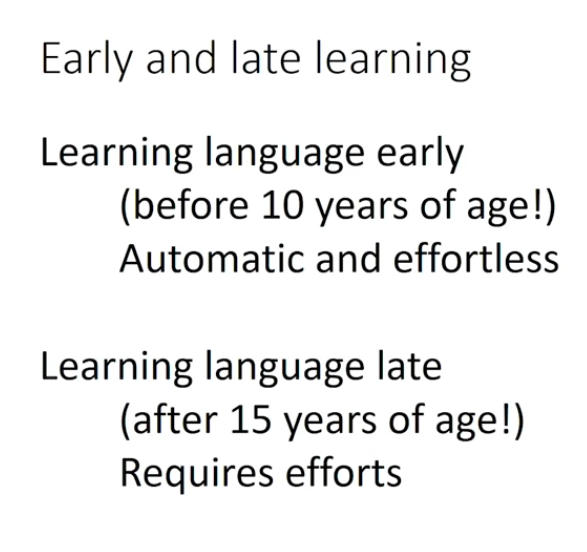  
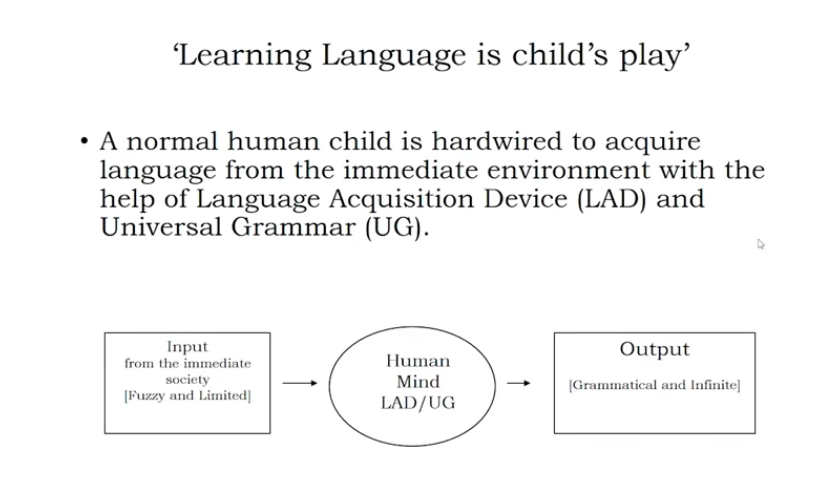  
  
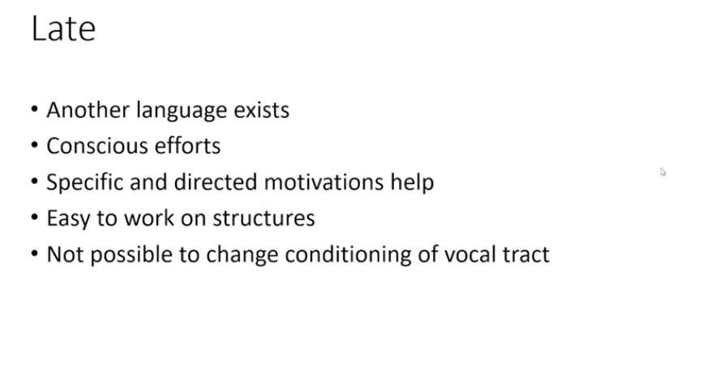  
  
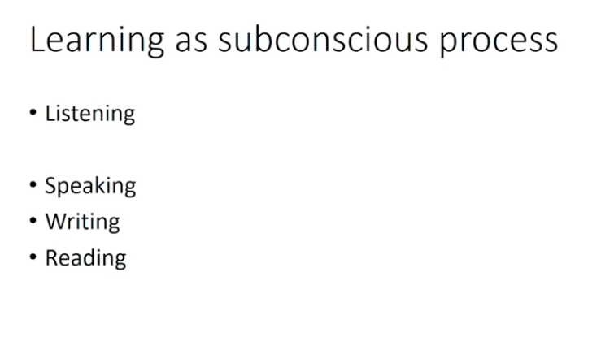  
  
*Today, I wish to formally welcome you to this course. And in order to do that, I want to speak with you about learning language. We are setting out on a journey to learn English, in particular basic English and its fundamental concepts. This course is part of a larger program on data science and computer programming. What do you want to learn in this course? It's also going to have implications for a lot of other things that you are going to look at. And if you wish, you will definitely get substantial stuff in this course, which will help you apply learning from this course, learning about language to understanding how data works. Because we are also going to underline how language works. And in that direction, today I want to speak to you about learning language. There is another objective of this discussion today. We will discuss the details of what we are going to do in this course. But more important aspect in my understanding is to discuss how we learn and what we do, what we must do to learn, in this case English effectively. What are the things that we pay specific attention to in order to have more impactful understanding and therefore impressive output, impressive production, that is impressive speech is to pay attention to things. I come back to that. But first, I wish to talk to you about how language learning works. Many of you must have thought about language learning. We can still go back and talk about language. What is language? Language is one of the most sophisticated products of the human mind. Human mind appears to be a very complex entity, but if you look at the process of learning of language, you realize that such a complex entity likes simplicity, likes pattern. Understanding patterns that requires finding out pattern underlying language in the reverse direction is all about learning language. All human children are born with this capacity to learn language. And therefore, as a child, we learn language automatically. That is, they start speaking words, then they start speaking two words, sequence of two words, and then small phrases, and eventually, before we realize, children start speaking sentences. So, this is what we mean when we say children learn language automatically. Keep in mind, as a child, every child, every normal human child is born with the capacity to learn a language. This is also known as aptism. We want to make a distinction between acquisition and learning. The difference is very simple. The difference is something that happens automatically, that is something that we acquire, is called acquisition. And when we have to put in efforts to do something, that is called learning. When children learn language, that is called acquisition, and when grown-up people learn language, that is called learning. So, that's the difference between acquisition of language and learning of language. For a child, it works differently, for grown-up people, it works differently. And very briefly, I would like to talk to you about that part. I will divide learning of language in two parts: learning of language that happens before 10 years of age, and learning of language that happens after 15 years of age. So, whatever happens in the process of learning or acquisition before 10 years of age is considered automatic and effortless. When we learn language after 15 years of age, that requires efforts. And this is the distinction that we are trying to make. I am specifically not talking about what happens between 10 to 15 years. That's the transition time. We can still learn it. I don't intend that between 10 to 15 years of age, people don't learn language. So, I'm trying to draw this line for my purpose before 10 years and after 15 years. We can draw it also in the following way: that before 12 years, after 12 years. So, these numbers are not important. I'm just drawing two lines here. So, orally, what I discussed with you is effortless, it's automatic, because the input children receive from hearing by hearing things around them results into output. This input in terms of data, in terms of language, is processed in the human mind, which is also known as computation of language in human mind, and the result is known as output, that is, the language that we speak. So, the result is naturally the result of computation in the human mind. So, this input doesn't have to be, is not really intended or designed towards learning. So it's random input, fuzzy input, it's very limited in quantity and nature, and the computation processes it in such a way that the output is systematic and medical and meaningful. So, and also it's infinite. This picture gives you that idea that we have input which comes from immediate society, it's very limited in quantity and very fuzzy in nature. And the output is grammatical and infinite. And the processing takes place in the human mind, which is a very important part for learning. And this is what we know as the process of learning for children. This process remains available for grown-up people as well. But a lot of other things happen. And this process becomes weaker and weaker for grown-up people. That is, after if we are making an effort to learn language after 15 years of age. So, what happens after 15 years of age is: think about it. By the time we make an effort to learn another language, we already have language existing with us. So, not because of that, but because it becomes bigger, we have to put conscious efforts to learn and we have to have that effort is also combined with specific and directed motivations. So, I'll describe this to you because this is going to apply to us. We already have language. Whether you are learning, whether you are going to make an effort to learn English from the scratch as a fresher, or you are going to work on improving it. I am quite clear in my understanding that most of you already speak English. So, it will be safe to assume that you are going, this course is going to help you improve what you know. So, for the purpose of this course, everybody falls in this criteria, this part, that we are going to make efforts in learning and improving language after 15 years of age. And the reason why I explained what happens before 15 years is because whatever we learn as language before 15 years of age is subconscious process. And therefore, we have to rely on exploiting that subconscious process most of the time. What happens? How do we exploit that existing subconscious process for the purpose of learning a new language is by observing patterns? And as a grown-up, it's easy for us to look at patterns and apply those patterns. If we do just these two, look at the pattern and apply the pattern and allow the subconscious process to function, it has impact and it results into learning. We don't have to memorize anything. We don't have to do anything which is tough to do. Remember, just do things: observe the patterns, try to understand the pattern, apply the pattern, and leave the subconscious process to function. This is part of learning by putting in efforts for grown-up people, linguistically adult people, after 15 years of age. We also have specific interest and motivation in learning. Therefore, we are here. Therefore, we are going to make this effort. If you have made an attempt in learning any language, including English, before, go back and check whether or not you had specific intellected motivation for doing so. I'm positive you will find the answer affirmative. For grown-up people, it is very easy to see patterns. Children figure out patterns in their subconscious. Grown-up people consciously observe the pattern and see that. Therefore, grown-up people have to be allowed to see patterns. And we need to talk about patterns for learning second, learning as a grown-up person. At this point, it is also important to understand that when we speak, and by the age of 15 years, with the sound system of the existing language, the language that we learned before 10 years of age, the underlying sound system of that language has conditioned our vocal traction. And therefore, we are the native speakers of our first language. That conditioning is so permanent and rigid that it will not allow us to get the sound patterns of the new language. And that must not worry us, that must not bother us. But still, if we understand the differences of those sound patterns and try to bring some of them in, we are still going to make changes by putting in conscious efforts, but it is not going to change it completely. Therefore, understanding this part helps you speak the way we speak. We don't need to change the way we speak. Rather, we can only improve the way we speak. We don't have to sound like anybody else. To be very specific, as emphatic, as a good, impressive communicator or impressive speaker of English, you don't have to sound like an American or a British or Australian. You have to sound like yourself. And this is quite scientific. This is how it works. And then this is going to be useful to you. From here, we start observing patterns. We need to understand this much about learning. So, one more time, one more time, we need to understand how learning of language works before 10 years of age. I have explained that to you. We need to understand how it works after 15 years and we need to put them together. That is, we have to allow the subconscious to function with conscious efforts. This will result in learning. We will work at all levels of learning in this course. Namely, we will work on improving speaking, we will work on improving writing, we will also work on improving reading. And eventually, what is also required is to improve listening. Many of you already know, almost all of you would know a good speaker must be a good listener. We need to practice it and we need to translate this into the process of learning. We don't mean it in a metaphorical sense, we mean it in literal sense. So, I'm going to talk about three, four broader points which are going to be essential for learning after 15 years of age. And doing these things have, I can say, dramatic impact on the process of learning. These things are listening. I invite you to listen to any audio material in English at least for half an hour every day. Maybe you are already doing so. But if you are not doing, you have to start. If you are already working on it, you have to do that carefully. This listening must not be devoid of attention. I suggest you pay attention to what you are listening, that is, the way the speaker speaks in that order, either audio or video. Preferably, you should listen to news bulletins, or for that matter, anything else will also work. But there must be some audio material else for half an hour, 30 minutes, at least 30 minutes every day. Likewise, you need to read at least half an hour every day. You need any kind of literature that interests you. You can read a story, novels, or any other kind of book. You may be interested in science, fiction, politics. You can read a newspaper, you can read a storybook. Fine, I specifically draw your attention to a combination of two things: any piece of literature, and everyday regular reading of newspapers. There is a reason why I invite you to read newspapers. Newspapers have simple, active, affirmative sentences in them. They have good impact on learning. With these two things, that is listening and reading, what improves in subconscious is speaking. So, you don't have to make a conscious effort of speaking, you have to allow these things to operate in your subconscious, which will have impact on whatever you speak. But yes, you have to keep speaking. And I'm sure you keep doing that anyway. You have to just do more on listening and reading for them to influence your speaking. And writing is a completely different story. We will talk about that as well, but I want to draw a distinction between them. See, learning to speak and learning to listen. Listening is prerequisit to speaking. These are combined things. I don't want to go into the details of that. But learning to write is a very specific skill. There are millions of people all over the world who speak the language, but they don't write. Therefore, writing is a specific skill. We will work on lighting as well. We will talk about how and what to do for improving our lighting skills as well. But primarily, I invite you to pay attention to listening, to do a practice on listening and reading for influential, effective speaking. So, these are the simple things that we can do hereafter, along with the patterns that we are going to discuss, to learn. I hope this discussion is going to be useful for you in following things that we are going to do in this course. One more time, I welcome you to this course on basic English for your degree in data science and computer programming at IIT Madras. We will also detail out the things that we are going to do throughout the course. Thank you*   
  
  
  
LECTURE 03: SOUNDS AND WRITING SYMBOLS IN ENGLISH  
  
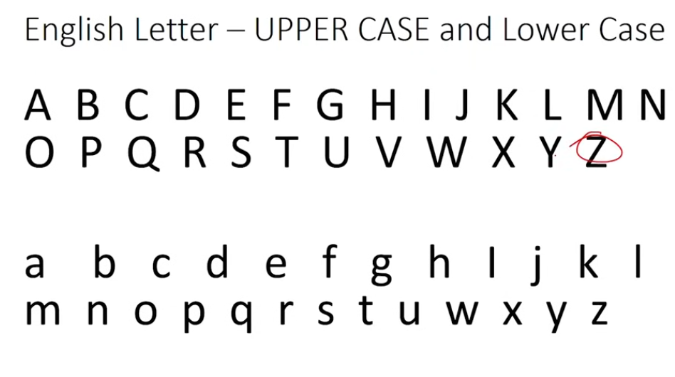  
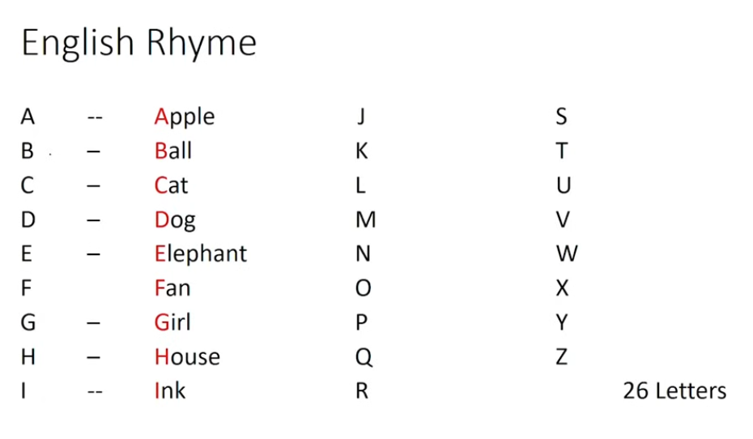  
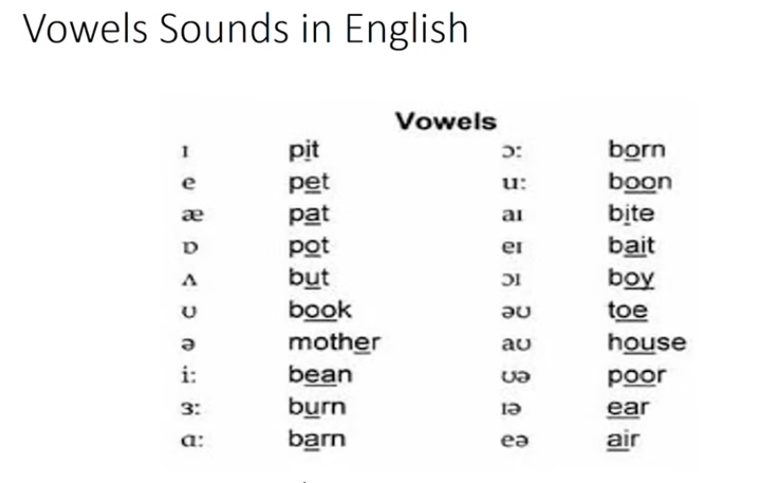  
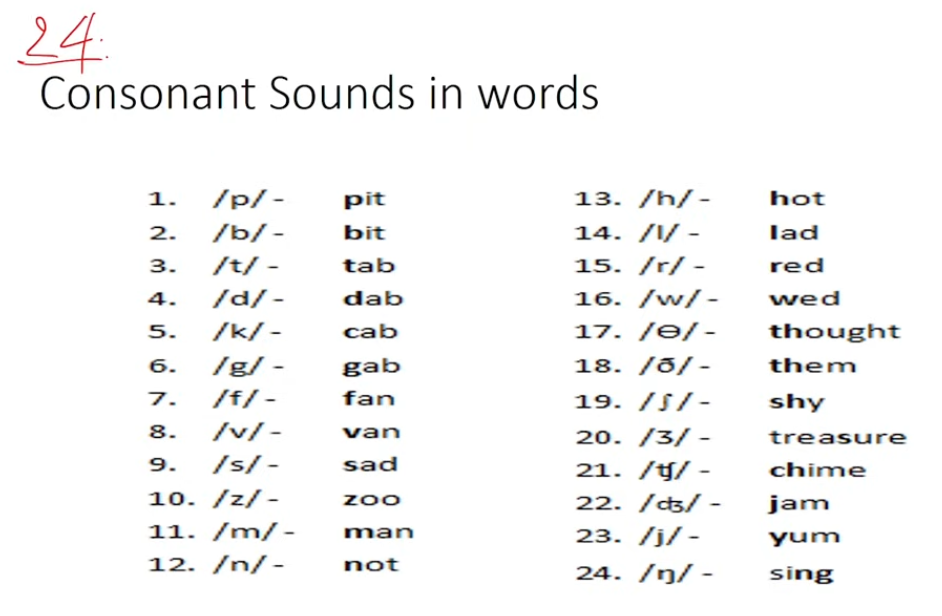  
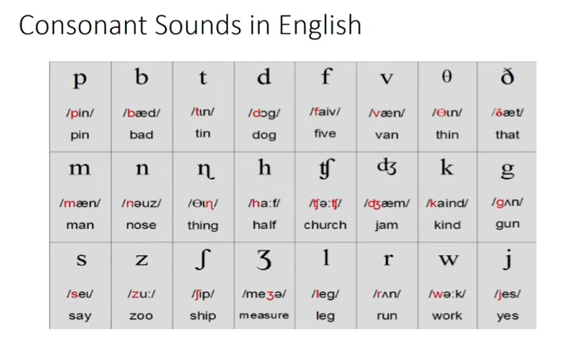  
  
  
*These are the two separate things, and right at the outset, that is right at the beginning of this class, I would like to tell you to pay attention to these things carefully. In order to learn different aspects of English language, it is important to separate these two. Once again, we are talking about writing system in English and sound system of English. If we try to simplify it further, we are going to be talking about how we spell things, that is, lighting system, and what happens when we speak? Are these two things different? If it is surprising to you, then you require even closer attention to these facts. They are very different things. Speaking is contingent upon sound system and writing, particularly in English, has a different system. That is, we follow, we have different symbols to represent sounds of English. We are going to elaborate on that today. As a note, as a footnote to this, let me also add to you that learning to write is one of the skills that we can learn by putting in efforts. But learning to speak, particularly for children, is quite intuitive. And once we pay attention to these things, things become easier for us to learn. Let's move ahead and talk about it. One more disclosure right at the beginning. We are going to be talking about writing system and sound system. We don't intend or we don't imply that we are going to begin teaching you alphabets. We understand that you know language and almost all of you are at many different levels in the process of learning. Through these things, we are trying to work on something, we are trying to draw your attention to something that is rarely paid attention to in the process of learning. So let me talk more about it when we move further. So one more time, learning to speak and learning to write. And we are going to look at these things for the purpose of learning English. When you learnt English alphabet for the first time, I'm sure you have paid attention to this, but I want to draw your attention to more questions and then going to invite you to check if these questions came to your mind. I am sure what you see on the screen is familiar to you. These are 26 symbols of English writing system. Depending upon when we started to learn English writing system, we have to learn this thing first. So, and these things are taught in different ways. Whatever method you applied to learn these things, you have learnt these 26 letters. They are A, B, C, D, E, F, G, H, I, J, K, L, M, N, O, P, Q, R, S, T, U, V, W, X, Y, and Z. Right from this point when we the last part, when we some people say this as G, some people say as Z. The difference is between British and American spoken system. In American system, this is known as Z. In British system, this is known as Z. That's how we, irrespective of the method applied in learning, we learn these things. Then you must have learned the second set as well: set one and set two. The difference between these two sets is one is called uppercase and the other is called lowercase. So uppercase symbols and lowercase symbols. I do not mean anything else when I say symbols. I know they are alphabets and they are used in writing system, but the reason why I am calling them symbols again and again is very simple, and I want you to know that. The reason is we use these symbols to represent sounds that we speak, and we will dwell upon that when we move further. But let's stick to the other question for the time being. And here is what I am inviting you to think: why do we have two different sets? Why do we have uppercase symbols and lowercase symbols? I know one answer is very simple. We use uppercase in the beginning of a word. When those words are used in a sentence, we used uppercase only at the first, at the initial position of the first word in the sentence. And then there are a lot of words which begin with uppercase. We use uppercases in abbreviations, and so on. We know. That's not my question. My question is: couldn't we have just one? What difference would it make? Why do we need two different sets? Think about it. Not sure. We have an answer to this question. Have you found an answer to this question for yourself so far? Please look at that. Try to find an answer for yourself. This is just an interesting thing. This doesn't have much to do with the learning part. Nonetheless, whether or not we have an answer to the question, we know that we have two different sets and we use them in a we know how to use them. So, like I said, uppercase, like one of them at the initial position of a word, and at several words within a sentence, also, but not every word within a sentence begins with uppercase. So, most often, proper names are for proper names, at initial position, we use uppercase like names, etc. A minute ago, we were talking about learning different methods of learning. Some people learn it through rhymes. Particularly for kids, there are a lot of lines designed so that it sounds like, sounds a little melodious, musical, and becomes easy for children to memorize them. And at the next stage of learning is they give words like A for apple, B for ball, C for cat, D for dog, E for elephant, F for fan, G for girl, H for house, I for ink, etc. I remembered the other ones too, but I have purposely left them blank because I want you to test your own understanding of learning alphabet at the initial point and see if you can fill up the rest of it. Now, so the first thing is learning the whole symbol through rhymes and then giving examples of those rhymes. So, these are the two different stages. Then I asked you a question: why two different sets like Y uppercase and lowercase? You're already going to think about that. Now, here is another question, and with that question, we begin our discussion in more serious sense. When we say A for apple, what do we mean? Say the word apple for yourself and see if you hear A in that apple, apple, where do we hear A in that? There is no A sound in the word apple. This is a disconnect. So, what we basically mean, and let me underline this again. I am not trying to make fun of it by drawing your attention to this. Neither I am trying to ridicule the sense employed within this process. What I am trying to tell you is when we teach kids and when kids memorize these things as A for apple, B for ball, C for cat, D for dog, etc., et cetera. What happens in that is they are trying to learn, or the purpose is to teach them lighting system. What is the lighting system? In the word Apple, the first letter is A. In the word ball, the first letter is B. That is the reason why we say A for apple, or A as in apple, B as in ball, C as in cat. So we mean the first symbol, first letter in the writing of the word cat is C, because there is no sum as cat, there is no sound as C in the word cat. What is the first sound in the word cat, which is represented with C. That sound is K. So, what are the sounds in this world? I'm purposely taking this monosyllabic one small word. K, eh, and t. So the word begins with k sound, but we write in the when we write the word cat at the initial position, we write C. So, and if you look at all of them, I have given you just a few examples of 1, 2, 3, 4, 5, 6, 7, 8, 9 words. In each one of them, there is no A sound in the word apple, no B sound, there is no B sound, no C sound, no D sound in the word elephant. Look at elephant. Do we have E? It's A elephant. F, there is no F sound because the sound is F. The sound is F, fine, fine. Girl, G. The sound is G. House begins with H. The sound is Ha. So, if you pay attention to many words in English, you will realize that the way we speak a word is different from the way we write, in the sense that there is no direct one-to-one correspondence between the sound system of English, that is the way words are spoken, and the way it is written with the symbols representing those sounds. This makes the learning a little more difficult. So, but my purpose of discussing this for you here is not to show you difficulty. My purpose is to draw your attention to this. And please remember a key word here: paying attention. Please keep paying attention to differences and similarities and the points where we are trying to draw your attention. An effort in looking at the underlying pattern and an effort in paying attention to these things will take you several steps ahead. Learning, as you know, is a subconscious process. By paying attention to these things, this effort will fix several things in your subconscious and then you will sound more confident. So, first step is to pay attention. The second step is to allow these things to function your subconscious, to fix some of them, and then the third step is to observe your own output, whether your learning has, whether your output has an impact of your learning or not. Watch yourself through this process, and you will see the results coming out, that is, results of your efforts coming out in your performance. That's a note on learning. So, the idea is not to show you difficulties, the idea is not to show you problems, but the idea is to bring your attention to this point. Point is, there is a disconnect between the two. Not a big problem. But we pay attention to this, and through that, we learn, we give priority to learning sounds. And I'm going to show you these things further, and then it will have an impact on learning. We will also talk about sounds to see the differences between, that is, our effort in paying attention to the sound system of English will also help us pay attention to how English sounds are different from sounds in the language that we primarily speak. And that difference, that understanding, is going to sort them out vividly, clearly, and it will have an impact on your learning. So, this is what you have seen. It's just another table of uppercase and lowercase symbols. So we use only these 26 letters to represent all sounds of English. We're going to talk about all of them. We are going to talk about each one of them. And then we are going to find them in different words. And you will see how they help you learn to speak. They help you learn to write, and they help you feel more confident in writing, reading, and speaking, and also in various different aspects, various different stages of your learning English. So, here is one more time I want your attention. I like this table, and therefore I brought this for you. So, this is uppercase, this is lowercase. Uppercase, lowercase. And this is English, this is a spelling of these letters. That is, how these, when we say B, how it sounds. And in this one, you have been given a phonetic transcription of sounds involved. So, pay attention to that. So, here is one. So, you will understand why I have put this square brackets. The first letter is A. How do we read it A? So, B, B, and long E. So, the letter, the pronunciation of the letter itself has at least two sounds in it, that is b and long e. Same thing with C, S and long E, C. So look at this. B, C, D, E, F, G, H, I H I J K L M N O P Q R S T U V W this word. This sound. W. The pronunciation of this one symbol involves sounds which is like a word: X, Y, Z, or Z. As I said, you can see here Z. So this chart helps you see the sounds involved in pronouncing these symbols, that is names of these symbols: A, B, C, D, E, F, G, H, I, J, K, L, M, M, O, P, Q, R, S, T, U, V, W, X, Y, and Z. One more time, take any word, any one of these letters and Z, like T, T, and long E, U, Y, and long U. V, W and long E. So they sound like a word. And when we learn them, memorize them, that's how we say these symbols. Now, so that's about writing. At this point, when I'm talking about the difference between lighting and speech sounds, I'm going to draw another distinction. And we will come back to these consonants and vowels again, but it's important to mention them right at this point. So when we learn how many vowels are there in English language, quite often you will find people say five and they are A-E-I-O-U A E I O U A E I O U No these are lowercase these are uppercase What we and that's not wrong what we mean in that is some of these symbols represent vowel sums. That's another thing which I want you to pay attention to. Some of these five symbols represent vowel sounds in English writing system. However, when we look at vocalic sounds, vowel sounds, so all the sums are classified in two categories. One is consonants and the other is vowel. The reason why we are talking about vowels first is because vowels are more fundamental to natural language. And you will see the meaning of more fundamental being more fundamental to natural language when we move on further. So here we have this chart gives you an example of 20 vowel sounds in English language. 20 vowel sounds in English language. And this chart also gives you an example of a word where they occur. So look at this, look at some of them at least. Pit, it has a vowel short e pet and these sounds are underlined in these words. Pat so e pot a book short being burn burn burn boon bite bait boy toe house poor ear these are twenty vowel sounds in English language. Please look at these examples carefully and read them several times, these examples. Pay attention to these sounds in these words. What it will do is it will get you think about vowel sounds in remaining words that you know, vowel sounds in other words that you will speak. Other than these, what you must also do is find another five words at least for each one of these vowel sounds. So that means I'm asking you to make a list of 100 English words where five examples for each one of these vowels. You don't have to do that in one go, you don't have to do that in one day. But if you can come up with a set of 20 words, 20 different words five times for each one of these 20 vowels. You'll get an idea of how vowel sounds work. If five sets sound too much, start with one and then try to pay attention to words that we write or speak. What are the vowels involved in those words? It will be quite an exercise and will have serious impact on how we understand vowel systems, vowel sums of English language. One more time to underline this thing: all these vowel sounds are all these vowel sounds become clearer in the words. We are not talking about again spelling, that is the way we write words. We are talking about sounds, the way we speak. Same way, there are 24 consonant sounds in English. And this chart gives you an example of each one of them within a wallet. So some of the words are repeated, and those sounds are, those vowels, those consonant sounds are given in capital. So what we are doing here is like pet. The sound is pa. We want your attention to the sound pa. Bit, attention to sound p, ka, attention to sound tab, attention to sound. D, cab, attention to sound. Tab, attention. G fan, attention to sound. Fan, sad, zoo, man, not, hot, lad, red, wed, thought, then, shy, treasure, shine, jam, yum, sing. So in the word sing, we want your attention to n, n sound. So these are 20 consonant sounds in English. One more time, I want to repeat myself, and I mean that is it possible for you to find at least five sets of words with these sounds. It should be easier with consonants. Please pay attention to them. Please do this exercise for yourself. And once you have these sets ready, the only thing you will need to do afterwards, or you will end up doing afterwards, is every word that you have. Not in formal writing or speaking, not every moment, every time, but in your subconscious, many times you will end up finding consonants and vowel sounds in the words that you speak. And that's a very productive exercise to do. So, with that, we are talking about 24 plus 20, that is 44 sounds of English language. Remember, there are only 44 sounds in English language. And these are the 44 sounds that are responsible for an infinite number of words that we make using these sums. We speak infinite number of words using these sounds, and I mean infinite in the sense that nobody knows the total number of words in any given language. Do you know about total number of words either in English or in the language that you speak as your primary language, as your native language? Do you know the total number of words? So, how and why a finite set of 44 odd sums are responsible for an infinite set of words in any spoken language of the world, including English, is no less than miracle. We will continue talking about some of them for the purpose of learning English. This is a promise. So, one more time. This is yet another table where 24 vowel sounds underlined, colored with their phonetic transcriptions like pin, bad, tin, dog, five, van, thin, that, man, nose, thing, half, church, gent, kind, gun, say, zoo, ship, measure, leg, run, work, yes. Sir, twenty-four, sir. And then you have again some examples here. And finally, finally, I know I have talked about too many exercises for one day, but they are not too difficult exercises. We will stop for today by telling you one more time. You don't have to do all these things in one go, but for the purpose of learning, for the purpose of checking whether the things that we have discussed, that is writing using symbols, as a completely different exercise than understanding sounds of the language when we speak. They are two different things. Sounds differently represented using 44 sounds are represented using 26 symbols for the purpose of writing. That itself is a complex process which we go through and learn. But paying attention, paying close attention to this, these 44 sounds of English is going to improve the way we are going to speak. Or when you are speaking, it's going to help you improve your speaking better. Thank you*  
  
  
  
*LECTURE 04: Speech Sound in English*  
  
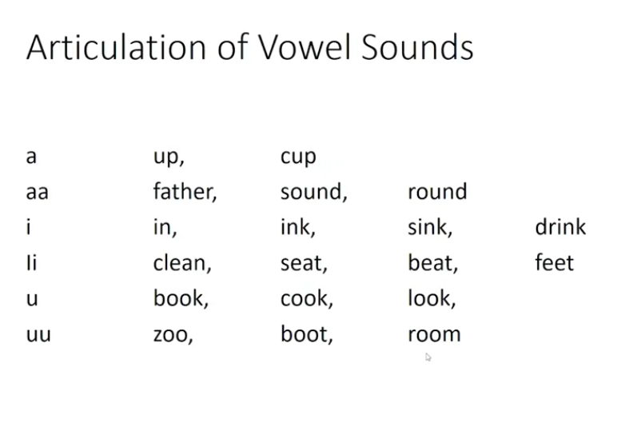  
  
  
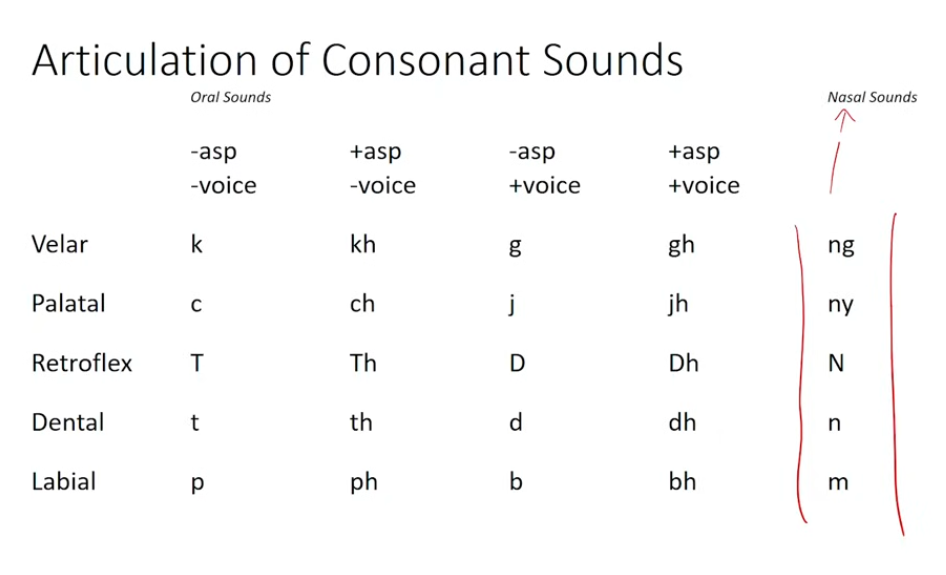  
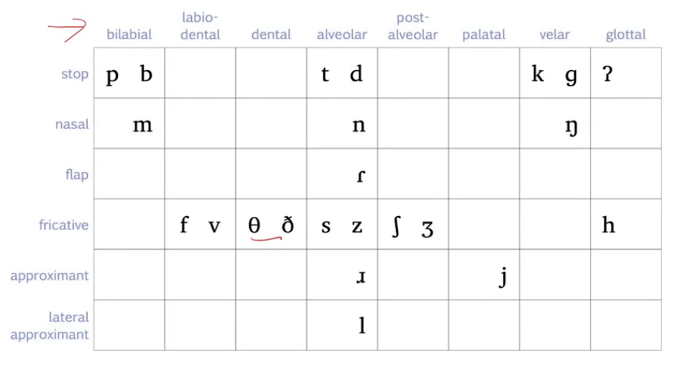  
  
*And welcome to the class. Today, we will talk about speech sounds in English. We know that sounds that we speak are different from how they are represented with the use of symbols in writing. So, we are going to pay attention to sounds the way they are spoken. As a note on this discussion on sounds, once we understand the mechanics underlying production of these sounds, the different places of articulation in our vocal tract, then we understand these sounds better, we compare these sounds better with the sounds of our own language, you know that all of us speak a language or multiple languages other than English. Our goal is to improve our speaking of English. We want to sound better when we speak English. In order to sound better, instead of practicing things blindly, if we pay attention to the specifics of the things that make difference between the languages that we speak, that is the sounds of the languages that we speak natively, and sounds of English, if we understand the differences properly, if we understand the specific features of sounds in English, then it becomes quite easier for us to improve our English speaking. It becomes easier for us to improve our pronunciation and then we sound better. And the moment we start sounding better, that adds to our confidence, effectiveness, and better communication. We know these things. We have to keep this in mind that a careful note, a careful attention to these things are going to add to the subconscious learning process. So let's go to go straight to understanding sounds. As we know, all sounds can be divided into two parts, two types: they are consonant sounds and vowel sounds. Vowels are more fundamental speech sounds because they are basic for building words. We will continue talking about them as well. For the timing, we are going to look at consonants and vowels, and in particular, for today, consonants in little greater details. So, look at this. We are talking about a sound like a. We are talking about a sound like a. We are talking about a sound like e this is. Now, you can tell that these are vowel sounds. Why are they vowel sounds? What do we mean by vowel sounds? And more specifically, what are the differences between these sounds? Let's very briefly look at it because we want to look at consonant sounds as well, and then having understood the details of consonant sounds, we will come back to vowel sounds one more time. Now, vowel sounds are produced without much obstruction in the vocal tract. Allow me to give you a note here about vocal tract and the process of production. You see, look at this picture. This picture details out articulators in our vocal tract. But at this moment, I want your attention to that. You know, we breathe air in. We breathe air in through this, and then all the way it goes to our lungs. It has other purposes for our survival and our physiology. However, exhaling flow of air is responsible for production of speech sounds. When we bathe in, we also breathe out. There is a function of lungs, it retains the kind of things that it needs, and remaining gets exhaled. The exhaling flow of air is responsible for speech sounds, not the inhaling flow. When we exhale, the flow of air gets modified at different places in our oral tract to give us different kinds of sounds, both consonant sounds and vowel sounds. I'll detail them out to you, that is, different places of articulation for different sounds. We will come back again and do them. The point that I'm trying to make here is the exhaling flow of air gets modified to a great extent in multiple ways for production of consonant sounds. But exhaling flow of air gets modified in a very minimal way for production of vowel sounds. We can also say vowel sounds are full. Vowel sounds are produced from the free flow of air. That sounds a little bit of exaggeration because no sound gets produced from free flow. There has to be some bit of obstruction, some bit of modification for production of sound. So we say vowels are produced with minimal obstruction of exhaling flow of air in our oral tract. That is just for you to explain. We brought this picture in to explain you just this part. With little modification, vowel sounds, with more and different kinds of modifications, we get consonant sounds. So that's the fundamental distinction between vowel sounds and consonant sounds. So going back to when we look at vowel sounds, try saying these vowel sounds for yourself and then you will realize what we mean by free, what people mean when they say free, and what we mean when we say minimal obstruction. So we can say a impact of this minimal obstruction is the thing that we can articulate, we can pronounce, we can say a vowel sound for longer duration of time until as much as we can hold our breath. So, for example, you try saying a or ah, we can continue saying like something of this type. But a consonant sound, this will not be possible for a consonant sound. If we try saying a consonant sound for a longer duration, then what we end up lengthening again is a vowel sound that is inbuilt vocalic sound a and not the actual consonant. Take an example: pa or k or ta. So when you say ka, if you make it for a longer duration of time, what allows you to make it longer is the vocalic element in the k, not the consonantal element. So, these are the fundamental differences between vowel sounds and consonant sounds. So, that's one distinction. So, what we know is we can produce a vowel sound for a longer duration of time. But in normal speech, we don't produce a vowel sound for a longer duration of time. In fact, we don't produce it for too long at all. Just say the words like up, cup. We have a vowel sound a here. We make it very short, depending upon the kind of word we have. So, up, up, we have a as a vowel sound. In ka, we again have a as a vowel sound. Then we have a as in words like father, sound, round. Again, like I said this in the beginning, the way we say a particular word is very different from how they are written. So, at this point, I have written them as English, as the way they are written in English, with their spellings and the symbols, the way they are used. But I want your attention to the sounds so you know that the first sound after, so let's say we have in these three words: father, sound, and round, you have first consonant sound, and the second vowel sound that you have is an example of a long vowel: father, sound, round. So a after fa in father, a after sa in sound, and after ra in the word round. And likewise, we have vowels. We see in, ink, sink, drink. So, here, short E at the initial position in these two words, and short E at non-initial positions in the remaining of the two words are there in these four words. So we have an example of short E and then long E. Long E in words like clean, seat, beat, feet. When we read these words, clean, this word has a long vowel sound after k and la. In the word seat, we have a long vowel. Otherwise, it's only the length of the vowel that makes a difference between these two words, like seat and sit. Only three sounds involve sa in the word. Seat, sit, save vowel in seat, short vowel in sit. That's the distinction between these two words, which mean two different things. So, you see the example of long vowels, long and short vowel e in these two, in these words. Then you have again examples of short woo, the distinction between short wu and long wu. Look at these two in words like book, cook, look. In all these three words, you have after see the vowel that you have is an example of short. And in these words like zoo, boot, room, the example of vowel that you have is an example of a long vowel. The examples are quite clear to you, I hope, and I'm sure they are clearer. And when you pay attention to this, it becomes much clearer. What I want you to do is to find more words and look for these distinctions between short and long counterpart of these vowels. I'm purposely discussing only a few vowel sounds for two reasons. One, I want your attention to the specifics of how vowel, what is the mechanism underlying production of vowel sounds. Second, I want you to look at the distinction between short and long pair. There are a lot more vowels available in any language, not only six, but I am giving you five examples to make these distinctions for yourself. So, as you can see, we have three pairs, and the distinction between these is they are the pair is short and long, short and long, short and long. So we have just three vowels: a, e, and u, and we have counterparts of longer duration, the pronouns for longer duration of the same vowel, which gives us three new sounds like a, e, w and these are fundamental vowel sounds which are largely available in most of the languages, including English, as you see from these examples. I also invite you to check these sounds in the languages that you speak primarily. Again, I make the distinction time and again, time to time, I keep talking about your primary language. All I mean is we all of us have another language with us other than English. If we keep paying attention to that language as well, if we see do these things apply to those languages as well, they have your attention to your own language has an impact on your efforts in learning of English as well. Then you become more aware and conscious or cautious about the sounds in English and the way these sounds are produced in English. One more time: the distinction between these vowels should be clearer to you, and we will come back to this after we have done some bit of practice on them. With that, we move to a discussion on some consonant sounds. And those consonants, I'll specifically tell you that this discussion may not be directly applicable to English consonants. Like I have mentioned that the six vowel sounds that we have discussed are part of English inventory of sounds in English as well. However, the vowels, the consonant sounds that we are going to discuss may not be, all of them may not be part of English. But allow me to describe this thing to you and then I take you to English sounds where you can see the distinction with a closer look. So, what is it that I'm asking you to do is just to look at these 25 sounds. There are 25 sounds in this chart, and I want you to look at it. Many of them are available in English. Many of them are available in languages that you speak. And many of them are definitely available in English when we Indians speak English. Therefore, I want your attention to this chart. And how let's go into the details how this chart helps us understand consonant sound. So, here we go. You see, we have, so what are these sounds first of all? Let me read them to you: k, k, g, g. And here is the last one. I'm keeping this separate. And I also want you to look at this. And so we have k, k, g, g. And then we have this nasal sound. So then you can look at this ch-ch-j-ch-d-den we have ch and then finally we have pa first point to note out of this chart of 25, we have 20 of them as OL sounds, and these five of them are called nasal sounds. What's the meaning? What's the distinction between oral and nasal? I'm going to show you that distinction. Before we go there, let's look at one more point and then we go and verify that. That point is K is known as a velar sound because it comes from velar. Cha is known as palatal sound because it comes from palate reason in our vocal tract. T is a retroflex sound. T is a dental sound. And P is a labial sound or bilabial sound because it comes from lips. So let's go back, backward. Pa, you can see both lips coming together to produce this sound, therefore, a bilabial sound. The tip of the tongue goes in the middle of upper teeth and lower teeth, and thus we get the retroflex meaning of that is the tongue, particularly the tip of the tongue, curls backward, folds backward, and in that fashion it hits the areas, muscular areas of upper teeth. Not the teeth, the muscular area of upper teeth, where we have our upper teeth infixed. That area is also known as alveolar. So the tongue, curled tongue, unfolds backward in the alveolar reason. The sounds that we get are called retroflex sounds. And that sound, one such example is d. Palatal sound because the body of the tongue, blade of the tongue, is in contact with palate area. Chir, chir, not the tip of the tongue, but the body of the tongue. And tongue has no, the tip of the tongue has no role in it because velum is quite low in our vocal tract. So the lower part of the tongue is in contact with velum area, and thus we get velar sounds. So I'll show you that. But so we talked about ka, cha, cha, ta, pa, but all these in this series, ka, ka, ga, ka, are velar sounds. All of them in this series are palatal sounds. Cha, ch, j, ch. They're all palatal sounds. They are all letter-fact sounds. T, th. They are all letter sounds. And p, th, ba, ba bilabial sounds. We come back to this part one more time, having looked at this one more time. We saw this picture when we were talking about vowel sounds. Now let's look at this picture one more time when we are looking at consonant sounds. Remember the exhaling flow of air? We have inhale this way and then we have exhaling flow of air from here. When it moves upward, look at this. This is the velum area. So the body of the tongue here, the exhaling flow of air gets modified in particular ways, and we will go back to those ways as well. And it gets blocked here, and then the sound that we get is known as ka. If you speak this sound and pay attention to the articulators, the place from where this sound comes, and the sound itself, you will realize that we are getting, you will understand this discussion on ka, ka, ka. I am putting this on record and I am speaking this to you through this video. There is nothing embarrassing about doing this practice for understanding the places of articulation of these sounds, for making our pronunciation, our speaking better. And you can give half an hour of time to yourself to check place of articulation of every sound that you are going to see at least once, and then you will get the point that we are trying to make through these articulators and through this detailed discussion on discussing sound production mechanism, the mechanics mechanism underlying sound production system. So that's the VLM area. Then we were talking about palatal. So at the next point where the body of the tongue produces a second set of sounds, cha is here. Then you have these teeth. So look at this. So what happens is the tip of the tongue goes here is our teeth area, and this is the muscular region. So the tip of the tongue folds backward and then hits this area in the alveolar vase region, this alveolar region, and then the sound that we get are called retroflex sounds. When the tip of the tongue, look at this tongue tip, tip of the tongue, comes in between these teeth. This, then we get a dental sound. And when these lips come together, we get labial sounds. So I'm only talking about five of them: velum, palate, this alveolar reason, tongue, teeth, and lips. These are fixed places: velum, palate, alveolar, reason, teeth reason, teeth, and lips. These are fixed places in our vocal tract. So, only one organ that can move backward and forward to get in touch with these areas is chunk. It's chunk. So, we through this picture we understand the places and movement. By this time, you must have figured out this is just a picture of a posterior picture of our Mongol tract. The point that I made right in the beginning about the distinction between nasal sounds and oral sounds is the following. So, and that distinction also you can hear when you speak the sound. So, when we say p and m say these two sounds for yourself and then see what kind of distinction do you observe between them. Say ta, dental, and n. Na. What's the distinction between these two? I'm particularly asking you to look at these two: ma and na. What is the distinction, and how does this distinction become critical? Here is how the distinction becomes. Please look at this. So, all the places of articulations that we talk about, like velum, palate, teeth, alveolaries, and lips, they are in the oral cavity. And then we have a big area as look at this nasal cavity, which is this area. And there is one more organ here. Look at this. This is uvulum. So, it is, if we open our mouth also a little wider, we see from the roof of this area, we see something hanging when we open our mouth wide open. That organ is called uvula. That's a very critical organ for sound production. And here is how it works. When this gets raised, look at this. This is the passage through which X-Fill exhaling flow of air moves. If it gets raised, then it blocks this cavity. It blocks this cavity, and no air moves through, no air moves through needle cavity. The movement, the air flows only through oral cavity, and thus the sounds that we get from different places of articulations are called oral sounds. When the uvula is not raised, it gets lowered down, then the part of the flow of this exhaling air can move through this nasal cavity as well. And then the sounds that we get are called nasal sounds. So, ma, when we say ma, uvala is lowered, air, little bit of air moves through the nasal cavity, little part from the exhaling flow. It moves through the oral cavity as well as the nasal cavity, and thus we get some nasal sounds. That's the distinction between oral and nasal sound. So, P is an oral labial sound, bilabial sound, and ma is bilabial nasal sound. And that's how we make the distinction. So now we understand the two-way distinction between oral consonants and nasal consonants, and we also understand the distinction about different places of articulations. What this part becomes clearer for understanding places of articulations. So, here is what I want you to do. I want you to look at this, do a very clear practice of these sounds with you and check their places of articulations. As I mentioned, most of these sounds are part of the languages that we speak. I come back. Here is another range of features that I will come back to. But right now, I want you to look at the features on this vertical axis. That is, they are places of articulation. I'll come back to these things later. For the time being, what I want you to look at is these sounds of English, these are 24 specific English sounds. They are ba, ba, ma. And I want you to pay attention to this axis. How do we pay attention to this axis? Look at this. These are the three bilabial sounds in English. Ph and wa are labiodental sounds. You can understand bilabial sounds are produced by both lips bringing together. Labiodental sounds are produced by lip, lower lip, and upper teeth together, labiodental. Ph and the are two dental sounds in English. T, d, n, r, sh and z are alveolar sounds in English. R, la. All of them are alveolar sounds in English. These two, sh and j, are post-alveolar sounds in English. Ya is a palatal sound, k, g, n are velar sounds, and these are ha and there is one more g, two glottal sounds in English. No, see, there are a lot of sounds here which are not part of our vocal tract, our sound system. So we need to learn these sounds separately to sound better while speaking English. At the same time, we need to do a little bit of modification in the way we have been speaking. If we bring in sounds from our languages in speaking English, we will sound the way we usually sound. But if we want to improve that, we need to understand this distinction, look at this chart of English sounds, and try to practice these sounds the way they should be produced, understanding their places of articulations. So, with this discussion on places of articulations and the distinction of sounds, we can very well get an idea of how consonant sounds are produced in English, and this will give you a clearer idea about sound system, a little bit about vowel sounds, and a little bit about consonant sounds. We stop here. I expect you to have done a little bit of practice. We'll see you again with something else*   
  
  
  
*LECTURE 05: Articulation of Vowels and Consonant Sounds in enlish*  
  
  
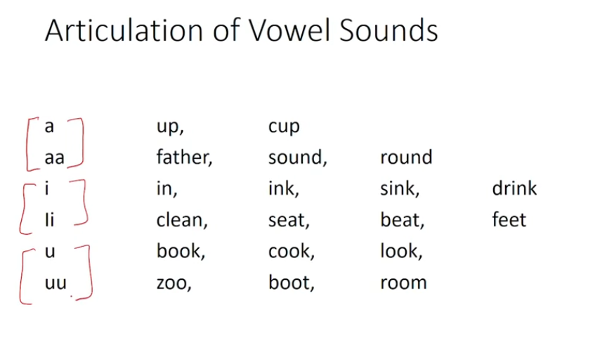  
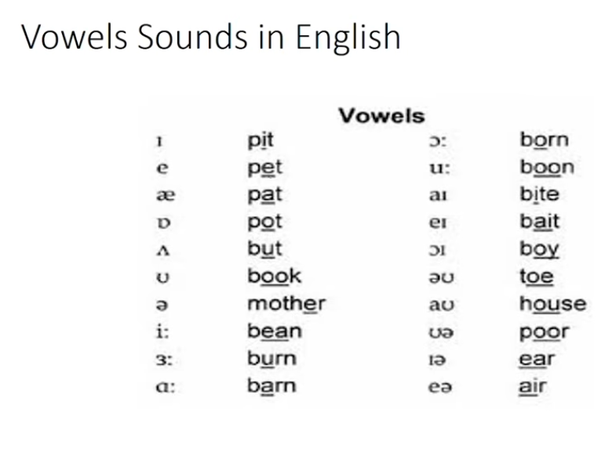  
  
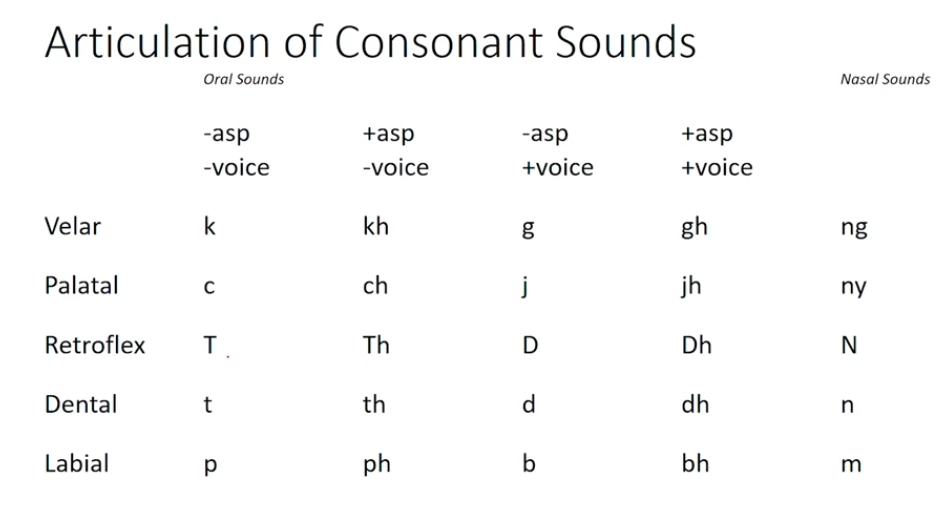  
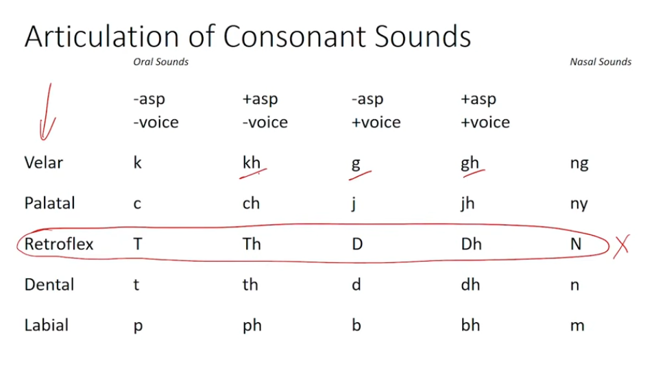  
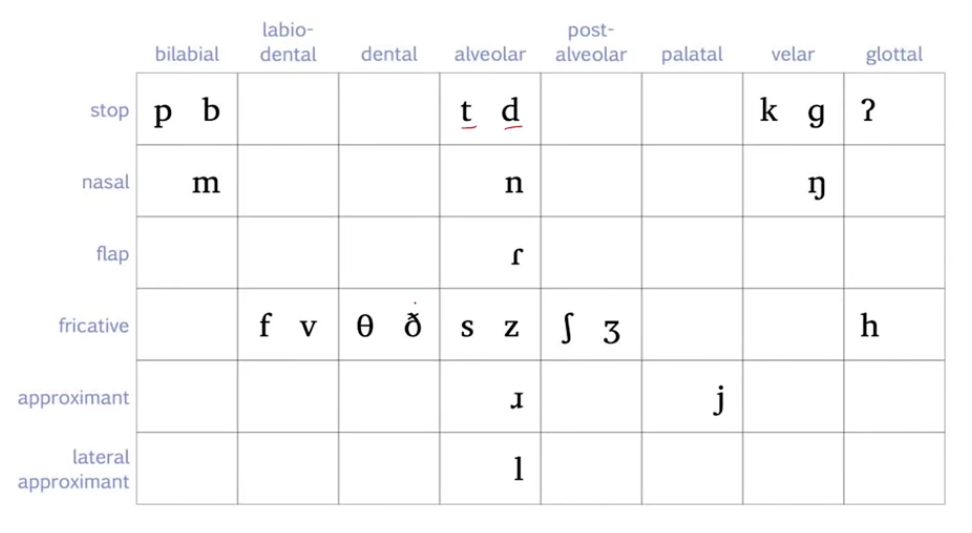  
*To the class. Today we will talk about articulation of vowels and consonant sounds. As you know, vowels are the sounds which are produced with minimum obstruction of the exhaling flow of air in the vocal tract. And consonants are the sounds that are produced with different kinds of modifications at different points in mobile tract. With this working understanding of consonants and vowel sounds, we want to look at a description of English vowel sounds and consonant sounds. At the same time, we look at a comparative study, comparative understanding of how certain sounds are different in our languages and certain sounds are very specific to English. And the way we understand that in order to make our speaking better, in order to make changes in the way we speak, we need to pay attention to certain sounds to make it impressive and fluent. And that is what we are going to look at today. So these are some of the vowels, some of the fundamental vowel sounds which has three pairs in them, and they have long and short alternations like a just six fundamental vowel sounds which are available in almost all the languages of the world. And then you can look at 20 vowel sounds of English in these words, and this is how they are represented with phonetic symbol. We don't need to pay much attention to phonetic symbols. However, it is just good to understand. But the important point is looking at these words and paying attention to the vowel sounds in these words. And we have 20 examples of different vowel sounds in English in different with examples of different words on this screen with you. So they are pit, pep, pat, pot, butt, book, mother, bean, burn, and barn. Just some of them, at least 10 examples. So, where we need to pay attention is in the word pit, we have short E, pit, pit, pick, pit. The vowel sound is A at the vowel sound is A thought. The vowel sound in this word is o but a short a in but short u mother asap in this word being long bird short u barn a born so if you if you look at words like at born you'll see the differences in these vowel sounds and these vowel sounds are specific to English language boom has long under you is there are a lot we don't need to look at how these words are written with their spellings we are looking at how certain sounds work in these words when we speak these words so these are you can do this exercise for yourself multiple times these are examples of 20 vowel sounds now let's look at this chart this chart doesn't have all 20 vowels in them in it but it has many of them and it is it's like this picture imagine this whole thing in our mouth and thus you will see then what when they say front central and back will make sense so these vowels like e is front wall the vowels here are central vowel and vowels here like back vowel similarly according to the tongue height they are close mid and open so basically this picture gives you a distribution of vowel sounds and sort of their places in the vocal tract in the oral cavity now we need to look at certain aspects of consonant sounds before we look at specific details of consonants of English so we understand certain things like there are places in our vocal tract which are responsible for different sounds like velum palate alveolar is teeth and lips so when we have sounds from velam they are called vela sounds sounds from palate they are called palatal sounds sounds from alveolar is called retroflex sounds sounds from teeth are called dental sounds and sounds from lips are called bilabial sounds we have looked at some of the examples of these like k as an example of velar sound cha as an example of palatal sound t as an example of retroflex sound t as an example of dental sound and p as an example of labial sound and then we looked at the distinction between oral sounds and nasal sounds at this point i want to specifically point it to you that this entire range of retroflex sounds are not available in English and we are going to discuss the implications of this and the way some of these sounds are produced in English. This much of fixing will help us improve speaking to a great extent. So before we go to that, let's look at one specific thing. So as we know on this vertical axis, we can describe sounds of natural language according to the places from where they originate or places of articulations. Now, if we know, so let me describe the following to you. If we know k is a velar sound and k is a velar sound too, g is a velar sound as well, and so is g. But these four sounds have their own distinctive identity. How do we describe the differences between these sounds? If we pay attention to two specific features, they are going to help us understand the differences between these sounds quite clearly. And these differences are: so, what's the difference between ka and ka? We see when we speak k, we have little additional flow of air, and this sounds as k. You can put your palm right in front of you, in front of your mouth, and when you say the two sounds one after the other, you can see additional flow of air as part of blow on your palm. That is called aspiration. And as I want to underline it again, the idea of description here is not that you don't know these sounds. The idea is to pay attention to the distinction, to the differences between these sounds, and there is nothing embarrassing about it to do these tests without laboratory for yourself so that you get the differences once for all, and then you can evaluate the differences between sounds of the language that you primarily speak and the sounds that you are going to be specifically careful about when we want to improve speaking of English. So, this additional flow of air, this additional flow of air in the form of small little blow, is called aspiration. So, if we make the difference between these two sounds in terms of additional flow of air, we see no aspiration with ka, which is here indicated as minus aspiration, and this one with additional flow is called plus aspiration. So, this much should be good enough to give us the distinction between these two sounds, ka and ka. Now, how do we make the distinction between k and g? There is yet another difference between the two, and this is quite specific, and it is little more difficult to notice than the distinction between ka and ka because ka and ka had an additional blow, additional flow of air, which can be realized externally. Now, let's go back to this picture again. And here, within this glottis, you see, within this vocal folds, we have this is vocal fold, and this has vocal cords in it. For some sounds, this chord vibrates little more than usual, and that vibration is technically understood as voicy. So, the difference between g and g is when we say ka, we don't have vocal cords within the vocal folds vibrating additionally, whereas k has a little bit more vibration, which is realized as resonance. So, sometimes if you put your hand in this area of, this is the area where we have vocal fold and vocal cord. And if we put our palm on this and then we say k and g one after the other, k, g. Then we hear, we feel that resonance on the palm. For some, it may not be clear, but and again, you can do this experiment to yourself and realize it. If it doesn't become apparent, you just need to understand it in the following way, in this particular way, to understand the distinction between these two. And thus, we get the difference between ka and k. So, k is no vibration, so minus voice and ga has vibration, so it has plus voice. So, on this axis, if you see, and if we put these two features together, then we can give distinctive identity to these sounds, like ka is no aspiration, no voicing. K is no aspiration, aspiration, little bit of additional flow of air, and no voicing. G is no aspiration but voicing. That is vibration. And this sound g has both aspiration and vibration. Thus, we see the distinction between all these four oral sounds from one specific place of articulation, that is velar. These sounds are velar sounds, and if we look at these features, then we get their identity. And thus, these 20 sounds, 20 oral sounds get specific identity. So, if you say no aspiration and no voicing, but from lips, that can only be power. So, labial, non-aspirated, non-voiced sound is only one that is far. And as we know, these are nasal sounds. There are certain specific things that we need to know about nasal sounds, which we will discuss at a separate point. So now we understand these sums, all these 20 or 24, 20 oral and 5 nasal, that is 25 sounds are parts of our languages. Most of them are spoken in India. But not all these sounds are available in English. Like I mentioned, the retroflex sounds, that is, the sounds which come from alveolar region when the tongue folds backward and tip of the tongue unfolds and hits this alveolar ridge. This sound is not available in English. So, when we go to the English consonant chart and try to look at their places of different places of articulations, and we try to understand the way they are produced, that is their manners of articulations, then we get this idea that P and P are labial sounds and they are both stopped, but one is non-voiced, the other is voiced. Ma is a nasal sound. Now, here is where here are the rest of it you can figure out. I want you to look at carefully: is this one: term, term, specifically? We don't have letterflex sounds in English. English t and t are alveolar sounds. So, let's go back to this picture one more time. How do we produce English alveolar sounds? Tip of the tongue without getting folded, and without this folding and unfolding, gently touches the alveolar ridge, and we get t. So it's not retroflex, it's a straight, simple alveolar sound without retroflex flexion. For many of us, it becomes tough because a close, a set of sounds that are very close to our languages are retroflex sounds. So, when we speak English, we tend to bring retroflex sounds in our English, whereas retroflex sounds are not available in English. And this creates a big difference in the way we speak and the way others speak. It happens, it's not a problem. It happens to us because most of our languages have retroflex sounds in them. If you are a speaker of a devidial language like Tamil, Telugu, Malayalam, or Kannada, they are full of retroflex sounds. At the same time, if you are speakers of Indo-Aryan languages like Hindi, Punjabi, Bhajpuri, Bagahi, Oriya, Bangla, and numerous of them. These languages too have a lot of retroflex sounds. Please take a note here: not as many retroflex sounds as we have in Dravidian languages. But Indo-Aryan languages do have retroflex sounds. So, at this point, everybody is in the same bracket that because of the availability of retroflex sounds in our languages, we tend to speak English in a particular way, which is sometimes called, or most of the time, called Indian English. Because one particular feature of Indian languages gets in our English. At times, people do not like the term Indian English, but trust me, there is nothing offensive about it. Indian variety of English, that is, the kind of English spoken in different parts of India, is named as Indian English. Just as English is spoken in America is called American English, or English is spoken in Britain is called British English, or English is spoken in Australia, or Africa are called African English, or Australian English. Just as like these varieties, we have Indian variety of English that most of us speak. And these are the reasons why our variety has a specific distinction of Indian, and this is called Indianness in our English. One more time, there is nothing bad or offensive about it. I want you to understand this in a very clear fashion that this happens to us because we speak our own languages, because the vocal tract that we are discussing here matures before 12 years of age. And if we learn a language after 12 years, then we can still learn. We can practice some of a new language, but we will, because our vocal tract has already matured according to the sound patterns of our native languages, it doesn't change. And therefore, we speak the way we speak. And thus, there is a scientific foundation for how and why anyone speaks the way they do. And this is the reason why we need to understand it to sound very confident about how we speak. Having said that, it is also possible with regular practice to imbibe other sounds, certain special sounds of other languages, like non-retroflex variety of t and d, which are alveolar sounds. And the purpose, as I mentioned in the beginning, the purpose of this description is for us to know the distinction between our ta that is retroflex, our ta that is retroflex, and English t. Once we know this, it's easier for us to work on it and make it sound alveolar when we speak English and keep it the way when we keep it retroflex when we speak either Tamil or Hindi or Punjabi. Same way, I'll give you one more example. Please look at this fa and v. These are two specific sounds in English which are very rarely available in our variety of languages. For example, Hindi, the P sound in Hindi, which was here, which is aspirated, non-voiced, bilabial, pa, as in pal, pool, is different from labiodental ph of English, as in father, French, fat, friend, all these words at the initial position have got a sound fa, which is labiodental, where we have upper teeth and lower lip coming together, and thus we get labiodental sounds. And this creates the distinction between. So the idea is when you go through the two separate charts of consonant sounds that I have described here with you, you can clearly see the difference between certain specific sounds of English and the way we speak certain sounds which may not be available in English. To come to conclusion, these are the 24 vowel, not 24 consonant sounds of English. And these 24 words have got 24 consonantal sounds in them, which you can practice for yourself. When we, and it is important and imperative for us who are trying to improve, who are trying to make it some of the better, it is imperative for us to do this practice to understand the differences between different sounds and to be familiar with 24 consonant sounds of English and 20 vowel sounds of English. Vis-<unk>-vis the vowel sounds and consonant sounds that we have in our languages. While doing so, you will also get to underline it for yourself that a lot of such consonant and vowel sounds are common as well. So do this maths. You will come up with a very small set of sounds, and working on those sounds make us very, very, it becomes important, it becomes clearer to us that if we work on these sounds, we can sound the way we want to in English. With this, we stop here. We expect you to do this practice and then we come up with this exercise as well. Bring the questions to us which may arise out of this, and then we will address them.*   
  
  
  
*LECTURE 06: DIPHTHONG AND SEMI-VOWELS*  
  
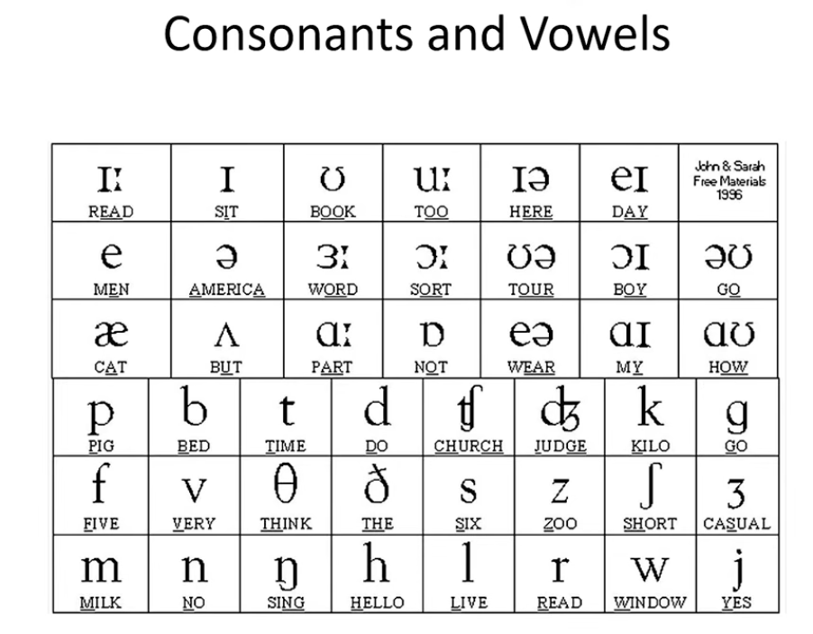  
  
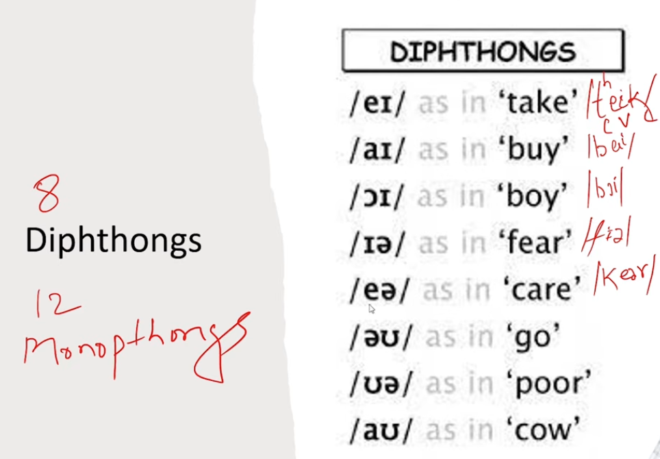  
  
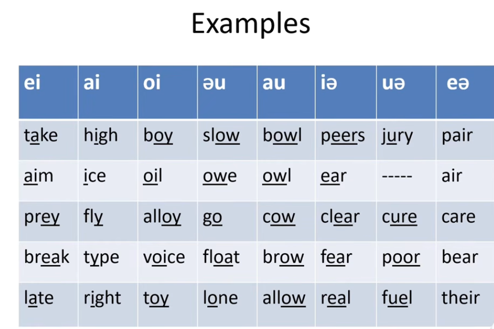  
  
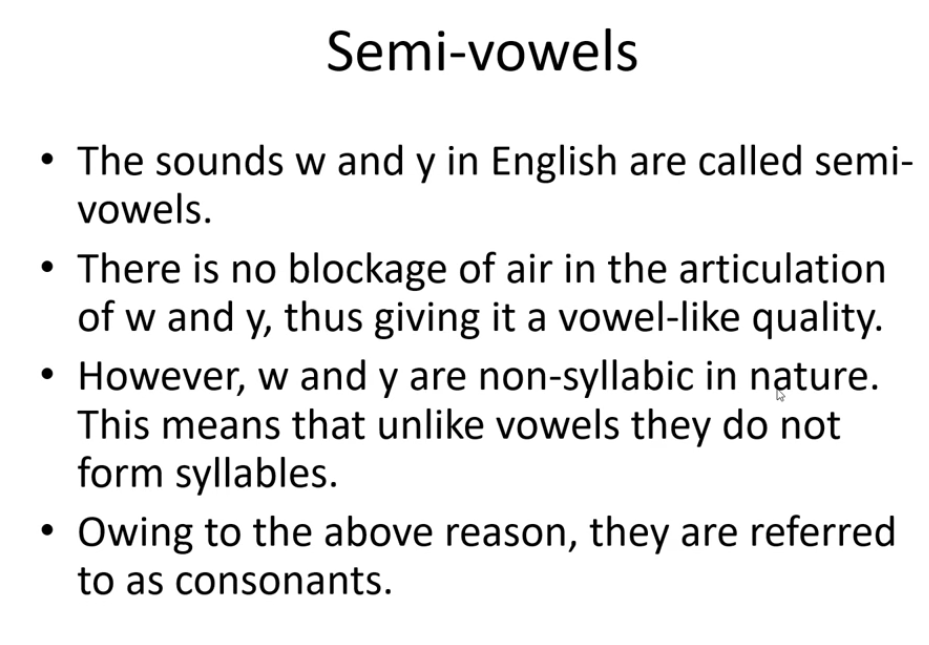  
  
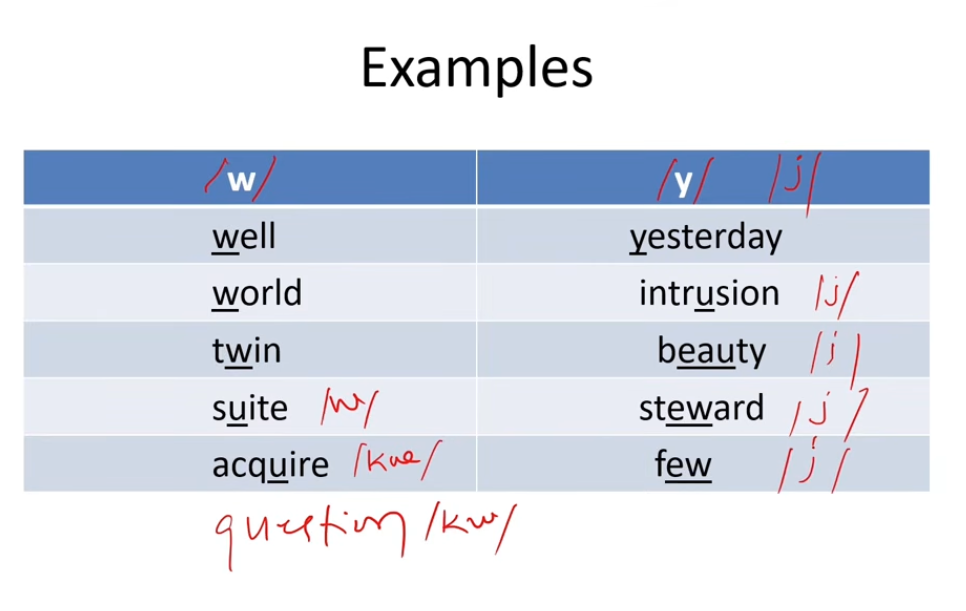  
  
  
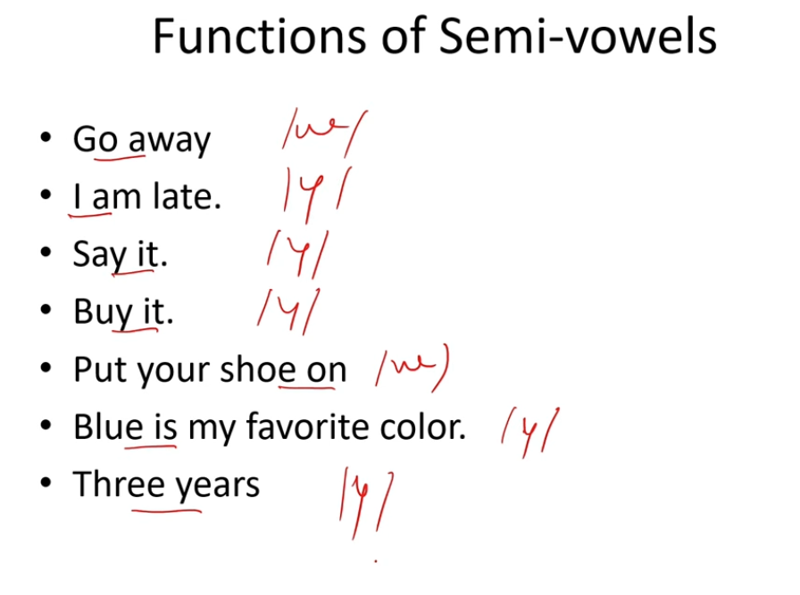  
  
*Welcome to the class. Today, we will talk about diphthongs and semi-vowels in English. These two terms, diphthongs and semivowels, they refer to two different types of sounds in English. We know there are sounds like consonants and vowels. If you look at the English sound system, English has a total 44 sounds, out of which 24 of them are consonant sounds and 20 of them are vowel sounds. When we go into the details of that classification, then we find among vowels, that is among 20 vowels, there are some vowels which are called diphthongs. And among consonants, there are two in particular and three in total sounds which are called semivowels. Keep in mind, semi-vowels are consonants, and we are going to see and look at the details of those sounds and how they function. This is what we know as 44 sounds of English. In that the first 20 sounds are vowel sounds. And let's take a moment here to understand that. So those sounds are E, as in read. Sit. This E sound is shorter than the previous one, as in sit. And likewise, you see all of them. So this is a short. So in a word like book, and when we say a word to, then you have longer. Then here is what I want to draw your attention to. So then we have A as in men, A as in America, this shorter sound, A as in America, and then you have O as in word and sort. This is another sound. Now, I want to draw your attention to some of these sounds which are called diphthongs, and I'll talk about them in details again. However, so look at this: ear, here. So this one, A as in day, as in tour, oi as in boy, and o as in go these are diphthong sounds in English, which are called diphthong vowels. So, if you see, if you want to go by classification, you can see that some are monophthong vowels and some are diphthongs vowels. Diphthong vowels simply mean a sound which starts with one vowel but ends with another. That vowel is called depth. We will look at the details of that. Now, among the consonant sounds, you have these 24 sounds as consonants. Look at the last three: the, wa, and ya. The classification of these consonant sounds is interesting to know and for complete understanding of the sounds that become so specific and so particular to help improve our pronunciation, help improve how we speak, how we understand, and so much more. It is important to know these sounds in details. And therefore, we are spending this time on explaining particular types of sounds to you so that it helps you better. One more time: being familiar with the sounds of the language we want to focus on and improve is fundamental for improving our language. Knowing the sounds in terms of their places of articulations and manners of articulations helps us immensely in improving our language. With these two fundamental principles, we work on it and we move further to explain these sounds to you. So, ra is a sound, one type of sound, and wa and ya, they form one category. So, wa and ya are particularly known as semi-vodels. You may have a question in your mind, these are consonant sounds. So, why are they called semi-vowels? The reason is very simple: they are consonant sounds, but they function more like a vowel. Therefore, they are called semi-vowel. And I'll show you, I'll explain what I mean when I say they function like vowel. They help vowels, therefore, they are called semi-vowels. Why not semi-consonants? That's not an important question for us because they are consonants, they are full consonants, so they cannot be called semi-consonants. They are called semi-vowels because they have vowels, they function like vowels. Again, third question for the sake of an argument: why if they function like vowels, then why not full vowels? They are not full vowels because you will learn it later in the course that vowel sounds are fundamental for syllabification. Allow me a moment here to tell you. Syllable is a smaller unit of a word. Some words are monosyllabic. That is, even one syllable can be a full word. A word can have more than one syllable. So, when we want to understand words in details, so moving from sounds to words, it is helpful to understand syllables. And one specific thing that we must know about a syllable is every syllable must have a vowel sound in it. Therefore, vowels are also called syllabic sounds. Now, coming back to semivowels, semi-vowels are not syllabic. Therefore, they cannot be full vowels. Hope this makes sense to you. Now, we start with diphthongs and then we will go to semivowels in this class. So, these are the 1, 2, 3, 4, 5, 6, 7, 8 of them are diphthongs vowels in English. So you can clearly see the distinction that 12 of them are monophthongs. That is, they have only one vowel quality, that is, they start with one and end with one. This one, these eight of them have these eight of them start with one, end with the other, and they are polia called montons. What do we mean when we say start with one and end with the other? Look at this. This one, A, starts with A and ends with E. Now, when we talk about these sounds in isolation, we can also say if they are two, if they are, they look like combinations of two different vowel sounds, then why don't we take them as two different vowel sounds? Actually, they are not two different vowel sounds when we say them, when we speak them in flow, in a word. So, they form a special category. Let's take it as given, and there are eight of them. So, first one is A, as in, how do we pronounce this word? Take, take this paying attention to these sounds will help you improve your pronunciation. We can say take. Take. Now, we can reach that pronunciation only when we know that this vowel sound here is a t. I, by, I, by, as in by and oi, as in boy, ear as in fear, ear as in care, o as in go as in poor, o as in cow. So, if you write the phonetic transcription of these words that are given here, this is how it becomes. So you have cha a and ka. So, there are three sounds in this word: consonant, vowel, and consonant. Only three sounds. And this ta also becomes a little aspirated. You will get to learn that further. So it's pronounced as take three consonants, three sounds in this word: cha, i, and a and ka, take by you have ba boy, ba and this is the phonetic transcription of bo write words with their phonetic transcriptions and identifying sounds that is the process to help improve our pronunciation. Fear, so we have sound for e and a fear k, ka, e, ear, and la, here. So, likewise, I suggest you do the phonetic transcription of these words and more to find these eight sounds. Important part: eight diphthongs and twelve monophongs. This is the classification of vowels, vowel sounds in English, that is, further classification. So, at one level, to conclude this part, at one level, we have seen all sounds being classified in two parts: consonants and vowels, 20 vowels. When we look further, we see 12 monophones, 8 diphthongs. These are the 8 diphthongs. This is how they sound, and this is how they appear in words. At this stage, one suggestion for you for your exercises to understand it further: please find these sounds in more words that we speak. You can take help online, you can read a word and identify sounds in them, and you will get to see these sounds as well. So, diphthongs are sounds. This is what we conclude with, which consist of a movement of a glide from one vowel to another. That is, starts as one, ends with the other. This process is known as glide. So, in other words, it's pronounced by combining two vowel sounds. Sounds that way when we speak it, but they are one, gliding from one to the other. The first sound in the combination is articulated longer and stronger than the second one. And in terms of length, they are like long vowels. So, you have seen eight dymes, and this is what they are, and see more examples of them. So, take, you have already seen high, boy, you have seen slow, bowl, pierce, jewelry, peer. All these words, when you practice further, take more words and practice them, you will get to see these oral sounds. You will also need to practice the distinction between monophthongs and diphthongs for better understanding of syllabification and your pronunciation. Now we move to semivowels in this class. There are two sounds: they are wa and ya. They are called semivowels in English. There is no blockage of an air in articulation of vow and yum. Remember, we discussed in the beginning why they are called semivowels. One more reason why they are called semivowels and why they appear like a vowel. If you look at places of articulations and the way we articulate a consonant sound, consonant sounds are always produced with obstruction in the vocal tract. As you understand, exhaling flow of air is responsible for producing speech sounds. And at different places in our oral cavity, in the entire vocal tract, the flow is stopped and modified in various ways, which give us different consonant sounds. This obstruction is important for consonant sounds, for a semi-mowel, which is known as a consonant, there is no obstruction. They are produced like bowels, that is, without or very little obstruction. This is what we mean when we say there is no blockage of air in articulation of wa and ear, thus giving a vowel-like quality. However, wa and ya are non-syllabic. We discussed they can be part of a word, but for that word to be a syllable, we need another vowel sound in that mere presence of either one of the two will not constitute a syllable. Now, when we try to see some words with b, let's look at this: well, world, twin, sweet, acquire with what. With your sound, you have words like yesterday, intrusion, intrusion, beauty, steward, fee. Now, important point to note here: these, remember, these are sounds. So, and they are written this way with these symbols. But these sounds appear in words not always when we spell a word with these symbols. So, in some words, they do, like, well, you see, being is L with W. World, you see, same thing happening. Twin, you see Wa coming in the middle of the world, not in the initial purpose. But look at this sweet. You do have a v sound here in this word, but there is no W. A choir. Here you see k and wa sound in this word, but there is no W. There are more words like questions. Question. Here also you have car and war. So, there are so many words where you do have a wash sound, that is a semi-vowel. Same way in when sound appears in a word, it may appear with y as a symbol, but it may not appear as well in the word like in trees. Look at this here. In fact, in terms of a phonetic transcription, this is how ear sound is written. So, in this, you will see a year sound here. In beauty, also, you see ear sound. In steward, also, you see ya sound. And few, of course, there is ear sound. You can have more words of this type to check where you get ear sound with why or not. Another important point about semi-vowels is that these semi-vowels, that is ya and wa, they may occur in a word, but they do not occur at a final position. That is, these sounds will never come at the word final position. Somebody can come up with counterexamples of this statement that semi-vowels do not occur in the final position. Somebody can say, Look at this word window. There is a W at the end of this cow. There is a W at the end of it. Happy, there is Ya sound at the end of it. There is Ya, Y, and Monday. There are many words where you have a word ending with why. The question is not whether they end with W or Y in their spelling. If you have understood, you do not need an explanation further that we are not talking about spelling of a word, we are talking about sounds. And in these words, also, there is no semi-vowel sound at the end of these words. So, in the word window, you have a dipongs. Cow, you have a and woo and you in window. Happy, you have E sound. Monday, you have distinct, not semivowels. So they do not, these two sounds are not in the not in the final position of these words. Then, so this is the introduction of semi-volume. So, you know so many things about semi-pollens. You know what those sounds are. You know the distinction between sound and spelling. You know that they do not occur in the final position of a word. You know that they are not syllabic because for making a syllable, they need another vowel and therefore they are called vowel sounds, semi-vowel sounds, not full vowels. For their production, they can be produced without much obstruction in the oral tract, and therefore they sound like a vowel, and still, because they are non-syllabic, they are called semivowels. So, you know so many things about vowels. Now is the time for you to know where is it used and what is its function in the language. Here, I need your attention. When you say these, I have a few phrases written here on this slide. When you say these words, pay attention to what's happening, and I am referring to how these things will be spoken or how these things are spoken by speakers of English who grew up speaking English. So, look at this: go away, go away. Now, in all these words, I'm going to underline some parts. I am late, said it, put your shoe on. Blue is my favorite color. Three years. When you pay attention to these underlying parts of these phrases or sentences, you will realize that these phrases and sentences, one word ends with a vowel sound, and the following word begins with a vowel sound. Check that. Go ends with a vowel sound, and away begins with a vowel sound. So, when you have this situation, I is a vowel sound and m also has a vowel sound in the beginning of it. Say has a vowel sound at the end of say, and it has a vowel sound in the beginning of it. Shoe on. Shoe has a vowel sound at the end of the word, and on has a vowel sound in the beginning of the word. Blue is blue has a vowel sound at the end of the word, and is has a vowel sound in the beginning of the word. And three has a vowel sound at the end of it, and ears has a vowel sound in the beginning of it. This is what we mean when I'm asking you to pay attention to these things. Now, in a normal, regular spoken language. There is a period of transition in these two words. So, to help the transition from one vowel to the other, there is a semi-vowel inserted in each one of these instances. And when you point it out, you will see that this is the actual function of semivowels. So, when we say go away, between the two, there appears to be a va sound. I'm late. I am late. So, see, when we hear this in regular speech, fast speech, there is a ya sound between I and I am. I am. There is a ya sound in between. Say it, say it before E, you have ya sound again. Same thing, bite. Put your show on. So it sounds like show on, show one. So, there is a W sound sound here. Blue is in this case ya sound, and three years, of course, ear sound. So, this is a function of a semi-vowel where, in the fast speech or normal regular speech, for transition between two vowel sounds which belong to two different words, we see the appearance of a specific sound, and they are either one of the two semi-vowels, here and one. Now, if you go into further details, you will see the distribution of ya and wa is also not random. When you have a rounded vowel, you have was, and otherwise, you have yas. So, the distribution of ya and wa is also fully patterned. There is a rule for why a va sound must come and why a ya sound must come. But the function is to help the transition between two vowel sounds belonging to two different words. This is one of the most important functions of semi-vowel. This happens in other languages as well, but here we are specifically discussing some examples of English. Now, again, I recommend you, we did some examples, I recommend you to look at some more words, phrases, sentences, and pay attention to that. When you listen to people who speak English, particularly speakers of English, those who grew up speaking English, you will notice these things. And an understanding of semi-violence in this fashion will help you understand others make sense faster and more carefully. When you hear others, it won't sound like you did not understand what they said. These are the things we need to pay attention to. Again, I stop it by telling you a careful understanding of these sounds, this information. That is information about depunks, types of novels, and semi-vowels will help you improve not only your pronunciation, that is not only how you speak, but also understanding how others speak. With that, we stop here. See you next time with some other information*   
  
  
  
*LECTURE 7: CONSONANT CLUSTERS IN ENGLISH WORDS*  
  
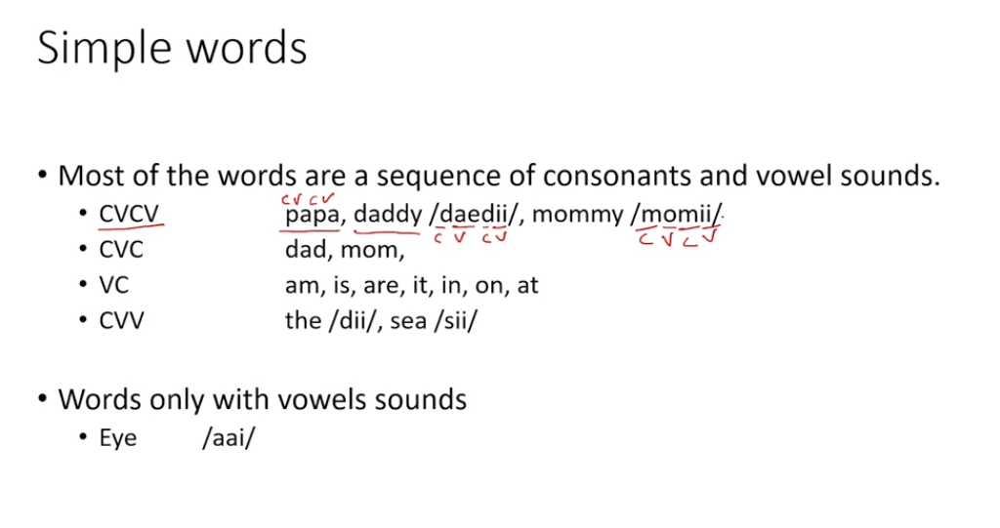  
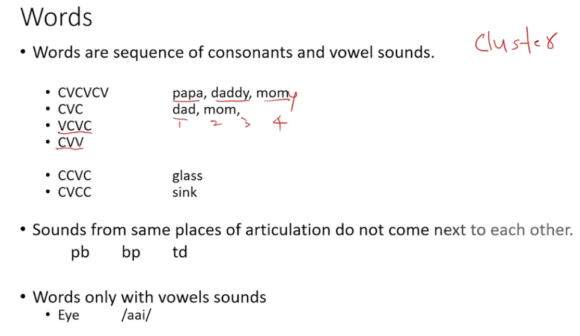  
  
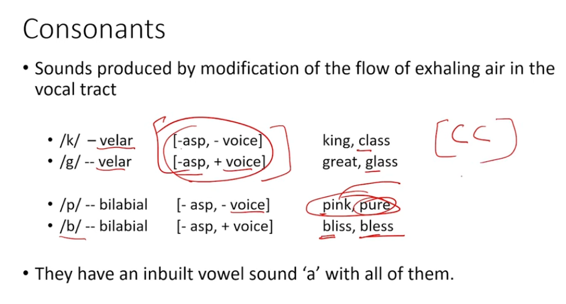  
  
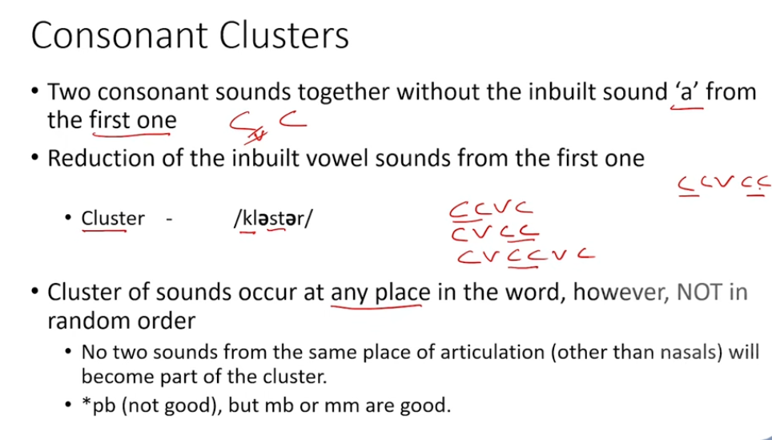  
  
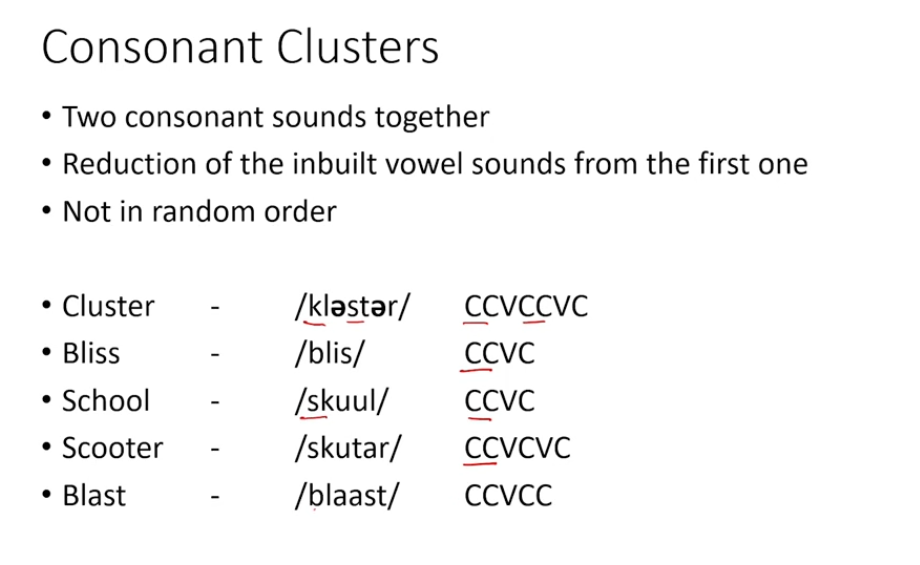  
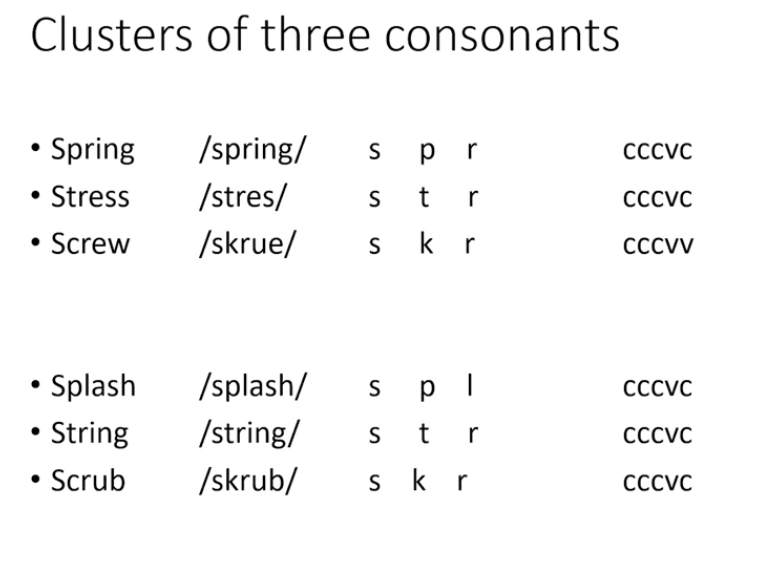  
  
*To the class today, we are going to look at clusters in English words. When we talk about clusters, we are talking about consonants that come together to make a cluster. In a word, we have only two types of sounds: they are consonants or vowel sounds. We know that we can not have a word without a vowel sound. So, a vowel sound, that is presence of a vowel sound in a word, is mandatory. Therefore, we also say vowels are fundamental sounds for the formation of words. Then we have consonant sounds. All traditions of consonants and vowels make a sound. Alternations of consonants and vowel sounds make a word. We are going to look at one specific aspect of that, which is known as cluster. I will take you through this whole understanding and to pay attention to the nuances of one specific thing that we observe happening in a world. Look at some simple words. What do we see in the words? Take a very simple word or simple, some simple words in a language and observe what you see and what and try to apply what we know about sounds. In a word like this, papa or daddy, mommy. So, I have given it to you here in a particular way. Look at this is the word papa. One of the simplest words for the following reasons: it has a sequence of, it has four sounds in it, and they alternate between consonant, vowel, consonant, and vowel. So, here we have pa is a consonant sound, a is a vowel sound, again pa is a consonant sound, and a is a vowel sound. That's how this word papa becomes an example of this sequence. We have a word like daddy. Once again, I underline here and suggest you not to look at the spelling of the word. Rather, pay attention to the sounds. When we say a word like daddy, these two papa and daddy, these two words mean the same thing, but they are written differently in English. But when you pay attention to the sequence of sounds in this word daddy, what do we see? D, eh, d, and e. Four sounds again, like here. We have one j, a, d, and e so here we see consonant, vowel, consonant, and vowel. So, d is a consonant, a is a vowel sound. These are not two different vowels. This is one vowel sound, a it's known as diphthongs. It's one of the diphthongs in English language. Again, another consonant sound, d and long. This word, mommy has again four sounds: ma as a consonant, or vowel, ma consonant again, e as vowel sound. So, all these words here, these words are examples of this sequence. Then we look at words like dad, mom. Please pay attention. These words mean the same. These words have same meanings. But look at it. When we say dad, it has three sounds in it: da, eh, and d, m, o, ma. So, here you have consonant, vowel, consonant in both these words, which is an example of this sequence. We have some simple words like am, is, or, it, in, on, at. These are independent English words. They are examples of vowel and consonant sickness. So, in all these words, you see a as vowel sound and ma as a consonant sound. Is e vowel sound z as a consonant sound or as a vowel sound and ra is consonant sound. It in on at they are all examples of sync. Then we see some examples of consonant, vowel, and vowel sequence. D. Like when we pronounce this word as the so you have a vowel, a consonant, and a vowel. C, you have a consonant and a vowel. So, with this, I am trying to show you the composition of a word in English for this. Here we are talking about English, therefore, we are only taking examples from English. However, if you extend this understanding, this applies in all languages. Check, please check the language that you speak. It is for the purpose of learning a new language, in particular for the purpose of looking at nuances of a new language, it is always helpful to check facts in our own languages as well. That is the language that we speak, the language that we grew up as being. So, when you check, it is true for your language as well that all words have a sequence of consonants and nons. They alternate between one another. There are only two types of sounds in all worlds in any language. And in all languages, you definitely have a vowel sound in a word. In other words, we cannot have a word, we cannot make a word without a vowel sound in any language. And here we have discussed such things with examples from English. So, what you know about English language here from this discussion is that we have a sequence of consonants and vowels as sounds in words in English. All words that we speak come from one or the other sequences. As I said, we cannot have a word without a vowel sound, but it's a fundamental sound in the language. We can have a word without a consonant sound. Very few words, though, but we can have a word without a consonant sound. We have words like I in this word, you only have a sequence of two vowels: a and e. And there are more words. I'm only giving you one example here to close the discussion on this sense. So, when we see here for words, we have consonant, vowel, consonant, vowel, consonant-vowel. If we take it as a fundamental template, what we see is all words will have alternations between polyphase. That's the formation of a word. Let's move ahead and look at clusters. We can look at some more words. You have seen these words. Now, we are going to introduce this notion of what we started with is cluster. What is a cluster? What is it that we call a cluster? We are going to show you some examples. So, when you look at it, these are the examples that we have just discussed: Papa, Daddy, Mom. We are basically mommy. Then they are examples of the sequence. Dad and mom are examples of this sequence. Now, I'm giving you two more sequences here and suggest you to find a few words in English, at least let's say one, two, three, four words, which come from this sequence, and four words that come from this sequence. Do this exercise, and you will see how you will get examples of these things when you think a little harder. Now, look at the next examples. We all speak these words quite frequently, and now I'm only asking you to pay attention to them. The word like glass. So, what are the sounds here? G, la, a, and sa. There are four sounds in this word as well. You have one, two, three, and four. When you look at the sequence of sounds in this word, you see it, you find it this. So, you have two consonants in the beginning, then comes a vowel, and then comes another consonant. In this word, sink, you again have sa and ka. So in this word, sa e, na, and ka. So, you have one, two, three, four sounds, but they've come in this sequence. Now, here I ask you to say these two words a couple of times, and you will see that the word is gloss. Please pay attention to this. The word is gloss, it's not glass, meaning there is a cluster between ga and la. These two sounds form a cluster. In the second word, na and ka, these two sounds form a cluster. That is, these two consonant sounds form a cluster. So, the first thing that we need to know about cluster is only consonant sounds form a cluster, not vowels. In fact, it is absence of the vowel that is called a cluster. Now, please pay attention to one more specific thing about cluster. As you know about sounds, consonant sounds, when we say consonant sounds independently, like ka, p, ch, take an example of any consonant sound. Inherently, you find a built-in vowel sound at the end of the consonant sound. In fact, it is not possible to say a consonant sound without the help of that inbuilt vowel sound in it. And that sound can only be a sound, a short a sound. Take an example of any consonant sound, and you will see this example test it. Now, when we make a word out of consonant sounds, then in some cases that built-in vowel gets completely deleted, and another consonant sound comes in, and such a situation is called cluster. And that becomes apparent in the speaking, also, where we do not hear that inwilt vowel sounding. Such a situation is called cluster. Therefore, in this word, we say glass, ga, and la consonant sounds are making clusters. You can note here that ga and la have two different places of articulations. Ga is a velar sound, la is a lateral liquid sound. N and ka. N is a nasal sound and ka is a velar sound. It is important to note because sounds from the same places of articulations do not come next to each other. That is, you will not see a cluster of pa and ba, ba and pa, ta and d. Why? Because pa and ba both are bilabial sounds. Ba and p again both are bilabial sums. Ta and ta both are dental sounds. So two sounds from the same place of articulation would not make clusters. We take some more examples to understand cluster in English words. Take this one, ka and g. So, how do we know ka according to place of articulations? It's a real sound. Ga also, according to place of articulation, it's a velar sound. But according to their manners of articulations, g is not an aspirated sound and it's not a voiced sound either. But g is voiced but not aspirated. So you know about aspiration, you know about voicing. These our understanding of these features, which are known as manners of articulations of the sound, help us understand, distinguish between two sounds like ka and ga. Ka and da, if they are both velar sounds, then what's the difference between the two? The difference lies in the way we speak those sounds, that is the manner of articulation. One is voiced, the other is not voiced. Both of them are non-ascerated, but one is voiced, the other is not voiced. This table helps you understand. Same thing for bilabial sounds. When we take two examples of bilabial sounds, we see pa and pa. We have pa and ba both are not ascribed, but pa is voiced and pa is not voiced. So we can see some examples like when we say king, we say ka i na but we can say class. Look at that. Ka and la are making clusters. In this one, ga and la are making clusters. In this one, pink pure. You have bliss and bliss. That is, ba and la are making clusters in both these words. So there is no cluster here. That is, think na and ka are making clusters. Pa is not in cluster with any sound. And this one does not have any cluster. So we just take some of these for examples to understand clusters. Hopefully, I hope you understand what we mean by a cluster. Two consonant sounds next to one another is called cluster. That is, each consonant has a small vowel in it, and when they make a cluster, the smaller sound goes. This is what we know as cluster. And it is important for us to understand because there are a lot of words in English and other languages as well where you see two consonant sounds making a cluster. This is what we have concluded: two consonant sounds together without that inbuilt sound form the cluster, where inbuilt sound is reduced from the first consonant. Two of them, the first one will have no vowel in it. That is reduction of the invelt vowel sound from the first one is what makes cluster. Now cluster of some so the word cluster itself has ka and la as a cluster. Sa and ta. It has two clusters. Sa and ta as a cluster and ka and la as a cluster. Cluster of sounds occur at any place in the world, however not in random order. What does it mean? What do we mean by any place? We mean we can have a cluster in the beginning of a word we can have a cluster at the end of a word. We can also have a cluster in the middle of a word. So here you have in the beginning, here you have an end, and here you have in the middle of it. Also, it's possible to have a cluster two clusters in one word. These are some of the basic facts about clusters that we need to pay attention to. We know, and I want to add here for your information: there are only 44 sounds in English languages. We have 20 vowel sounds and 24 consonant sounds in the language. That is in English language. How is it that we have millions of words out of only these 44 sounds? That is because there is no limit on how sounds occur in a word, how many sounds occur in a word, how many syllables we have in a word. Usually, we do not find too long syllables, that is too many sounds in a word, but it is normal to have a word with four sounds, five, six, seven sounds, and to have more number of sounds in a word, we need some clusters. So, formation of cluster in natural language is a natural phenomenon, and therefore we are drawing our attention to these things. No two sounds from the same place of articulation, we have just described that and we are underlying it again for you, can become part of a cluster. So, pa and ba will not make a cluster. Ma and ba alma and ma are good. That is because one nasal sound and one non-nasal sound can make a cluster from the same place of articulation, but not two non-nasal sounds from the same place of articulation can make a cluster. So, this is some more information about cluster only. So, if you see the examples of more words like cluster itself, as I discussed, it has two of them in it. So, here and here. Bliss, you have a cluster of ba and la in the meaning of the word. School, sa and ka in the beginning of the word. School there, sa and ka in the beginning of a word. Blast, ba and la again in the beginning of a word, and sa and ta at the end of the word. So, these are some of the random examples of words with clusters. Now, here on, when you look at a word, please see if you can find a word in the cluster, that is cluster of consonants. You don't have to be meticulous about it every time you speak, but to understand the notion of cluster, at this point, I suggest you to take examples of 20 words and see how many of them have clustered something. That's the story about cluster symbol. Now, we need to discuss one last point about cluster of consonant sounds in English in the following. You see, we have just noticed that a cluster of two sounds may occur at any position in a word. That is, a cluster of two sounds occurs in the beginning, in the middle, or at the end. So, there is no restriction on where a cluster of two sounds occur in a word. However, if you pay attention, we have a lot of words in language. Words without clusters can be millions, but words with cluster are not story. The total number of possible words with clusters and total number of possible words without clusters. There is a massive difference between the number of these two types of ones. However, it is also possible to have a cluster of three consonant sounds in English language. It's possible in other languages as well, but here we are only going to look at examples from English languages. It's possible to have, please take a note, it's possible to have a cluster of three consonant sounds as well, particularly in the beginning of a word. It is possible elsewhere as well, but we are going to look at specific examples of cluster of three consonant sounds in the beginning of a word. And when we look at that, I invite you to find some similar examples. But please take a look at this whole notion first and then find examples for yourself. So, when you look at a word like spring, stress, cream, you see in the beginning of a word, these are the three consonant sounds that are making cluster. What are those sounds? They are sa, pa, and ra. In second word, you have sa, ja, and ra. In third word, you have sa, ga, and ra. Look at a set of another terms: plus string, ska. You have sa pa la in this one, splash string, sa ta, and scrub s k and please note, in all these words, you have a cluster of three consonant sounds in the beginning of your word. However, when you take a look, close look at it, we find something surprising, something very remarkable. Look at this. What do you find here? In this set, what you see is the first consonant of this type of cluster is always sa and second consonant is pata arka. And the third one we see is ra. In the second set, also, we see first set sa, second set pata ka, and here we do find one la. So, if we take a look at this, then we see we have sa, pa, ta, and ka and ra and la. This is what we see coming out as a template for cluster of three consonant sounds. Now, do we look at these? I will help you look at that. If you see pa, ta and ka, they are all voiceless stop sounds. They are all each one of them velar stop, dental stop, and bilabial stop. Velar, dental, and bilabial stop. And la and la are liquid sounds. And sa is a fricative. Now, now I suggest you to find more words. You can find words like this: screen, scroll, scrutiny, stress, scrap, strand, strict, strip, spring. I want you to invite you to add more words to this. Interestingly, what you are going to find is this pattern in all these words. No words, and here is the conclusion. Please take a note of that. No word with a cluster of three consonant sounds in the beginning, that is in the beginning of a word, gets any sound other than these as the member of the cluster. So you will never find a word which have got a cluster of three consonants and in the beginning has any sound other than some. Take a look at it. Do this exercise for yourself. And you will see, you will relish the joy of underlying structure of language. Languages are the role governed and they have definite structure in it as it is. Constituents of data science, you need to keep your eyes open for finding patterns. This is one example of finding patterns in underlying structure of language. And this is what the basic core structure of language is, the word foundation is. And this is how we look at the structure of words, and this is how we look at how we understand clusters. Now, I can also add one final thing to it: that you do not have a cluster of four consonant sounds in the beginning of a word. No word is possible with a cluster of four consonant sounds in the beginning of a word in English. There are some words where cluster of four consonants at the end is possible, but they are going to be very few. In fact, words possible with a cluster of three consonant sounds in the beginning of a word, such words are also very few in the middle. As you can see, we have got a list of few of them. I invite you to make a list of few more. That will give you an idea of his structure, idea of cluster of consonants in English words. Now, the main point of this class is to understand clusters. What is it that makes a word simple word, and what is it that makes a word with cluster of consonant sounds in it? That is one point. The other thing is when you pay attention to these things, it helps you grow not just for calorie but also your pronunciation. With the help of these things, you can actually improve your pronunciation tremendously. You can develop confidence about understanding of these nuances of language for yourself. At the same time, you also get to see how we look for patterns within language. But that's all. We will meet you next time with something new. Thank you.*   
